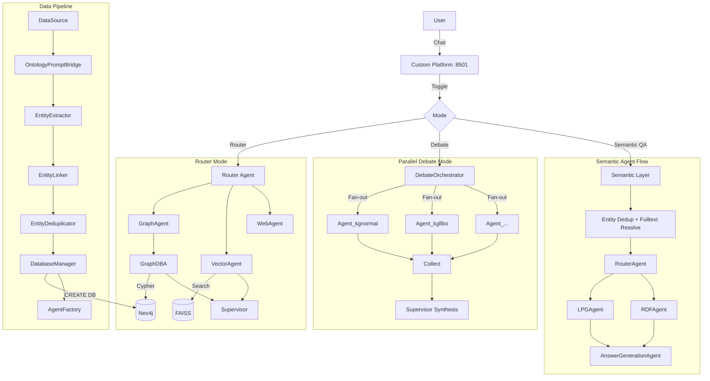

# SEOCHO

**Agent-Driven Knowledge Graph Platform**

[](https://github.com/tteon/seocho)
[]()

SEOCHO transforms unstructured data into structured knowledge graphs and provides dynamic, per-database agent pools with **Parallel Debate** orchestration for multi-perspective reasoning.

## Current Consensus

- Runtime: **OpenAI Agents SDK**
- Trace/Eval: **Opik**
- Graph DB: **DozerDB** (fixed)
- Tenancy: **Single-tenant MVP**, with `workspace_id` propagated for future expansion

> **Note on Terminology**: SEOCHO has standardized on **DozerDB** as the primary graph database engine. However, because DozerDB is fully compatible with the Neo4j Bolt protocol and Cypher query language, you will frequently see the terms **Neo4j** and **DozerDB** used interchangeably throughout this documentation, CLI flags, and architectural diagrams.

## Design Philosophy

1. Extract domain rules and high-value semantics from heterogeneous data into a SHACL-like semantic layer.
2. Preserve extracted data in table-first form and build ontology artifacts (`.ttl` and related files) as merge-time decision evidence.
3. Use entity extraction/linking with ontology-aware prompting (`prompt + ontology` context to LLMs) to convert related records into graph structures.
4. Maintain a 1:1 mapping between graph instances and graph agents.
5. Keep router agent as default request entry, selecting graph instances that can answer user intent.
6. Operate router/graph-agent interaction under supervisor-style orchestration, with ontology metadata driving query-to-graph allocation.
7. Treat agent-layer telemetry as first-class data and track every flow with Opik.

Additional viewpoints adopted by SEOCHO:

- **Provenance-first governance**: every extracted fact and rule should remain auditable to source chunk/document.
- **Confidence-aware control**: routing/disambiguation decisions should expose confidence and support deterministic overrides.
- **Contract-first DAG integration**: backend emits strict topology metadata (e.g., `node_id`, `parent_id`, `parent_ids`) so frontend trace canvas renders real execution graph, not heuristic layout.
- **Closed-loop readiness**: semantic quality is operationalized via `/rules/assess` (validation + exportability) before rule promotion.
- **Versioned ontology lifecycle**: ontology/rule artifacts are treated as versioned control-plane assets, not ad-hoc runtime state.

## Planes

### Control Plane

- Agent routing/instructions and runtime policies
- Deployment and quality gates
- Decision governance (`docs/decisions/*`)

### Data Plane

- Ingestion/extraction/linking/dedup
- SHACL-like rule inference and validation
- Graph load/query against DozerDB

---

## How It Works

```
                         ┌── Agent_kgnormal ──┐
User Question ─► Debate  ├── Agent_kgfibo   ──┤─► Supervisor ─► Answer
                Orchestr. └── Agent_...      ──┘    Synthesis

User Question ─► Semantic Layer(entity extract/dedup/fulltext) ─► Router
             └──────────────────────────────────────────────────► LPG Agent
                                                                ► RDF Agent
                                                                ► Answer Generation Agent
```

**Data Pipeline** turns heterogeneous raw material into queryable knowledge graphs:
```
PDF/CSV/JSON/Text → Parse to text → LLM 3-pass (Ontology + SHACL + Entity) → Relatedness gate + Linking → Neo4j/DozerDB
```

**Multi-Agent Reasoning** queries those graphs in parallel:
- Each Neo4j database gets its own agent with closure-bound tools
- All agents answer independently via `asyncio.gather()`
- Supervisor synthesizes a unified response
- Backend emits topology metadata for DAG-grade UI trace rendering
- Optional semantic route uses 4-agent flow:
  - `RouterAgent`
  - `LPGAgent`
  - `RDFAgent`
  - `AnswerGenerationAgent`

**Rule Constraints (SHACL-like)** infer validation rules from extracted graph data:
- infer required/datatype/enum/range rules from dataset patterns
- annotate node-level constraint violations
- export rule profile for downstream graph governance

---

## Quick Start

Canonical user-onboarding path lives in `docs/QUICKSTART.md`.
If you want to validate raw data -> graph -> semantic/debate chat end-to-end, follow that document first.

### Prerequisites

- Docker & Docker Compose
- OpenAI API Key

### 1. Clone & Configure

```bash
git clone https://github.com/tteon/seocho.git
cd seocho

cp .env.example .env
# Edit .env — set OPENAI_API_KEY=sk-...
```

### 2. Start Services

```bash
make up
```

### 3. Open Custom Platform

Go to **http://localhost:8501** — use the custom interactive operations console (frontend + backend specialists).

UI highlights:
- left navigation rail (`Semantic`, `Debate`, `Router`)
- operations table for trace inspection (search + type filter)
- semantic candidate panel with confidence filter and pin-based overrides
- raw-ingest panel (`Ingest DB`, `Raw Records`, `Ingest Raw`) for user-provided text-to-graph loading

Use **Execution Mode** (`Router`, `Debate`, `Semantic`) to switch runtime path.

### 4. Try the API

```bash
# Router mode (single agent)
curl -X POST http://localhost:8001/run_agent \
  -H "Content-Type: application/json" \
  -d '{"query": "What entities exist in the knowledge graph?"}'

# Debate mode (all DB agents in parallel)
curl -X POST http://localhost:8001/run_debate \
  -H "Content-Type: application/json" \
  -d '{"query": "Compare financial entities across all databases"}'

# Semantic graph QA mode (entity extraction + fulltext resolution)
curl -X POST http://localhost:8001/run_agent_semantic \
  -H "Content-Type: application/json" \
  -d '{
    "query": "Neo4j 에서 GraphRAG 관련 entity 연결을 보여줘",
    "workspace_id": "default",
    "databases": ["kgnormal", "kgfibo"]
  }'

# Ensure fulltext index exists for semantic resolution
curl -X POST http://localhost:8001/indexes/fulltext/ensure \
  -H "Content-Type: application/json" \
  -d '{
    "workspace_id": "default",
    "databases": ["kgnormal", "kgfibo"],
    "index_name": "entity_fulltext",
    "create_if_missing": true
  }'

# Runtime raw material ingestion (text/csv/pdf records can later be queried in chat UI)
curl -X POST http://localhost:8001/platform/ingest/raw \
  -H "Content-Type: application/json" \
  -d '{
    "workspace_id": "default",
    "target_database": "kgnormal",
    "records": [
      {"id":"raw_1","source_type":"text","content":"ACME acquired Beta in 2024."},
      {"id":"raw_2","source_type":"csv","content":"company,partner\nBeta,ACME"},
      {"id":"raw_3","source_type":"pdf","content_encoding":"base64","content":"<base64_pdf_payload>"}
    ]
  }'

# (Optional) Build ontology hints from OWL for semantic reranking
python scripts/ontology/build_ontology_hints.py \
  --ontology ./path/to/domain.owl \
  --output output/ontology_hints.json
```

---

## Access Points

| Service | URL |
|---------|-----|
| Custom Chat Platform | http://localhost:8501 |
| API Docs (Swagger) | http://localhost:8001/docs |
| Neo4j Browser | http://localhost:7474 |

**Neo4j credentials**: `neo4j` / `password`

---

## Observability with Opik

SEOCHO includes [Opik](https://github.com/comet-ml/opik) for LLM tracing, evaluation, and agent visualization. It runs as an opt-in Docker Compose profile:

```bash
# Start with Opik
make opik-up

# Access Opik dashboard
open http://localhost:5173
```

Opik auto-traces all OpenAI calls, agent executions, and debate orchestration with parent-child span trees. No code changes needed — it's baked into the pipeline.

```bash
# Stop Opik (core services keep running)
make opik-down
```

---

## Architecture



---

## Project Structure

```
seocho/
├── extraction/                # Core ETL + multi-agent system
│   ├── agent_server.py        #   FastAPI: /run_agent, /run_debate, /run_agent_semantic
│   ├── pipeline.py            #   Extract → Link → Dedup → Schema → Load
│   ├── debate.py              #   Parallel Debate orchestrator
│   ├── agent_factory.py       #   Per-DB agent creation (closure-bound tools)
│   ├── semantic_query_flow.py #   Semantic route: entity resolve + router + LPG/RDF/Answer agents
│   ├── shared_memory.py       #   Request-scoped agent shared memory
│   ├── data_source.py         #   DataSource ABC (CSV, JSON, Parquet, API)
│   ├── ontology_prompt_bridge.py  # Ontology → LLM prompt injection
│   ├── deduplicator.py        #   Embedding cosine-similarity dedup
│   ├── database_manager.py    #   Neo4j DB provisioning
│   ├── config.py              #   Centralized config + env-first YAML loaders + DatabaseRegistry
│   ├── tracing.py             #   Opik integration (opt-in)
│   ├── ontology/              #   Ontology definitions (base, loaders)
│   └── conf/                  #   YAML configs (prompts, ingestion schemas)
├── evaluation/                # Custom frontend platform (FastAPI static app)
├── semantic/                  # Semantic analysis service
├── demos/                     # Agent and tracing demos
├── docs/
│   ├── ARCHITECTURE.md        #   Detailed architecture reference
│   ├── QUICKSTART.md          #   5-minute setup guide
│   └── ROADMAP.md             #   Development roadmap
├── docker-compose.yml         # Core + Opik (profile: opik)
├── CLAUDE.md                  # AI agent execution guide (source-of-truth workflow)
├── AGENTS.md                  # concise agent operating rules for this repo
└── .env.example               # Environment template
```

---

## API Reference

| Endpoint | Method | Description |
|----------|--------|-------------|
| `/run_agent` | POST | Router mode — single-agent routing |
| `/run_agent_semantic` | POST | Semantic entity-resolution mode (router/LPG/RDF/answer) |
| `/run_debate` | POST | Debate mode — all DB agents in parallel |
| `/indexes/fulltext/ensure` | POST | Ensure fulltext index for semantic entity resolution |
| `/health/runtime` | GET | Runtime health (API, DozerDB reachability, Agent SDK adapter) |
| `/health/batch` | GET | Batch/pipeline health (separate from runtime API readiness) |
| `/platform/chat/send` | POST | Custom platform chat endpoint |
| `/platform/ingest/raw` | POST | Ingest user raw material records (`text`/`csv`/`pdf`) into target graph DB |
| `/platform/chat/session/{session_id}` | GET | Read platform chat session |
| `/platform/chat/session/{session_id}` | DELETE | Reset platform chat session |
| `/rules/infer` | POST | Infer SHACL-like rule profile from graph payload |
| `/rules/validate` | POST | Validate graph payload against inferred/provided rules |
| `/rules/assess` | POST | Practical readiness assessment (validation + exportability) |
| `/rules/profiles` | POST | Save a named rule profile for a workspace |
| `/rules/profiles` | GET | List saved rule profiles in a workspace |
| `/rules/profiles/{profile_id}` | GET | Read one saved rule profile |
| `/rules/export/cypher` | POST | Export rule profile to DozerDB Cypher constraints |
| `/rules/export/shacl` | POST | Export rule profile to SHACL-compatible artifact (Turtle + shape JSON) |
| `/databases` | GET | List registered Neo4j databases |
| `/agents` | GET | List active DB-bound agents |

**Request body** (`/run_agent`, `/run_debate`):
```json
{
  "query": "What companies are in the financial ontology?",
  "user_id": "user_default",
  "workspace_id": "default"
}
```

**Request body** (`/run_agent_semantic`):
```json
{
  "query": "What is Neo4j connected to?",
  "workspace_id": "default",
  "databases": ["kgnormal", "kgfibo"],
  "entity_overrides": [
    {
      "question_entity": "Neo4j",
      "database": "kgnormal",
      "node_id": 101,
      "display_name": "Neo4j"
    }
  ]
}
```

**Request body** (`/platform/chat/send`):
```json
{
  "session_id": "sess_001",
  "message": "Neo4j와 GraphRAG 연결을 설명해줘",
  "mode": "semantic",
  "workspace_id": "default",
  "databases": ["kgnormal", "kgfibo"]
}
```

**Request body** (`/rules/infer`):
```json
{
  "workspace_id": "default",
  "graph": {
    "nodes": [{"id": "1", "label": "Company", "properties": {"name": "Acme"}}],
    "relationships": []
  }
}
```

**Request body** (`/rules/assess`):
```json
{
  "workspace_id": "default",
  "graph": {
    "nodes": [
      {"id": "1", "label": "Company", "properties": {"name": "Acme", "employees": 100}},
      {"id": "2", "label": "Company", "properties": {"name": "", "employees": "many"}}
    ],
    "relationships": []
  }
}
```

**Response** includes `response`, `trace_steps`, and (for debate) `debate_results` with per-agent answers.
Debate responses also expose `agent_statuses` (`ready` or `degraded`) and `degraded` for partial-availability handling.
When all debate agents are unavailable (`debate_state=blocked`), platform orchestration falls back to semantic mode.

---

## Key Concepts

### Ontology-Driven Extraction

Define your domain as a YAML ontology. The pipeline auto-generates LLM prompts from it:

```yaml
# extraction/conf/schemas/my_domain.yaml
graph_type: "MyDomain"
nodes:
  Company:
    description: "A business entity"
    properties:
      name: { type: STRING, constraint: UNIQUE }
  Person:
    description: "An individual"
    properties:
      name: { type: STRING, constraint: UNIQUE }
relationships:
  WORKS_AT:
    source: Person
    target: Company
```

### Dynamic Database Provisioning

Each dataset gets its own Neo4j database. Agents are auto-created per database:

```python
from database_manager import DatabaseManager

db_manager = DatabaseManager()
db_manager.provision_database("supplychain", ontology=my_ontology)
# → Neo4j database "supplychain" created, schema applied, agent spawned
```

### Parallel Debate Pattern

All registered DB agents answer the same question independently. The Supervisor synthesizes disagreements and agreements:

```
User: "What are the key financial entities?"

Agent_kgnormal: "Found 3 companies and 5 people..."
Agent_kgfibo:   "Found 2 bonds and 1 issuer..."

Supervisor: "Across both databases, the key entities are..."
```

### SHACL-like Rule Constraint Inference

Pipeline can infer and apply lightweight constraints after deduplication.

```yaml
# extraction/conf/config.yaml
enable_rule_constraints: true
```

Generated output includes:

- `rule_profile`: inferred rules
- `rule_validation_summary`: pass/fail node counts
- `nodes[*].rule_validation`: per-node violations
- `/rules/assess.practical_readiness`: readiness status/score and actionable recommendations

Rule profiles can now be exported directly for governance rollout:

- `/rules/export/cypher` for DozerDB constraints
- `/rules/export/shacl` for SHACL-compatible Turtle + shape JSON

Practical run:

```bash
curl -s -X POST http://localhost:8001/rules/assess \
  -H "Content-Type: application/json" \
  -d @sample_graph_payload.json | jq '.practical_readiness'
```

Local demo script:

```bash
python scripts/rules/shacl_practical_demo.py
```

---

## Development

```bash
# Run tests
make test
make test-integration
make e2e-smoke

# Lint & format
make lint
make format

# Agent docs baseline lint
scripts/pm/lint-agent-docs.sh

# Load sample financial data
docker exec extraction-service python demos/data_mesh_mock.py
```

See [CLAUDE.md](CLAUDE.md) for coding rules, patterns, and module reference.
See [docs/ARCHITECTURE.md](docs/ARCHITECTURE.md) for detailed architecture.
See [docs/TUTORIAL_FIRST_RUN.md](docs/TUTORIAL_FIRST_RUN.md) for first end-to-end run.
See [docs/WORKFLOW.md](docs/WORKFLOW.md) for control/data plane workflow.
See [docs/PHILOSOPHY.md](docs/PHILOSOPHY.md) for the design philosophy charter and operating principles.
See [docs/PHILOSOPHY_FEASIBILITY_REVIEW.md](docs/PHILOSOPHY_FEASIBILITY_REVIEW.md) for expert-panel feasibility criteria and execution gates.
See [docs/GRAPH_MODEL_STRATEGY.md](docs/GRAPH_MODEL_STRATEGY.md) for graph representation strategy.
See [docs/SHACL_PRACTICAL_GUIDE.md](docs/SHACL_PRACTICAL_GUIDE.md) for practical SHACL-like rollout guidance.
See [docs/ISSUE_TASK_SYSTEM.md](docs/ISSUE_TASK_SYSTEM.md) for sprint/roadmap issue-task operations.
See [docs/ADD_PLAYBOOK.md](docs/ADD_PLAYBOOK.md) for agent-driven delivery workflow.
See [docs/CONTEXT_GRAPH_BLUEPRINT.md](docs/CONTEXT_GRAPH_BLUEPRINT.md) for context graph rollout.
See [docs/OPEN_SOURCE_PLAYBOOK.md](docs/OPEN_SOURCE_PLAYBOOK.md) for open-source extension patterns.
See [docs/decisions/DECISION_LOG.md](docs/decisions/DECISION_LOG.md) for architecture decision history.
See [docs/README.md](docs/README.md) for active-vs-archive doc map.

For seocho.blog sync, keep `README.md` and `docs/*` aligned as the source of truth.

---

## Contributing

We welcome contributions for new ontology mappings, agent tools, and pipeline enhancements.
See [CONTRIBUTING.md](CONTRIBUTING.md) for guidelines.

## License

MIT License.
