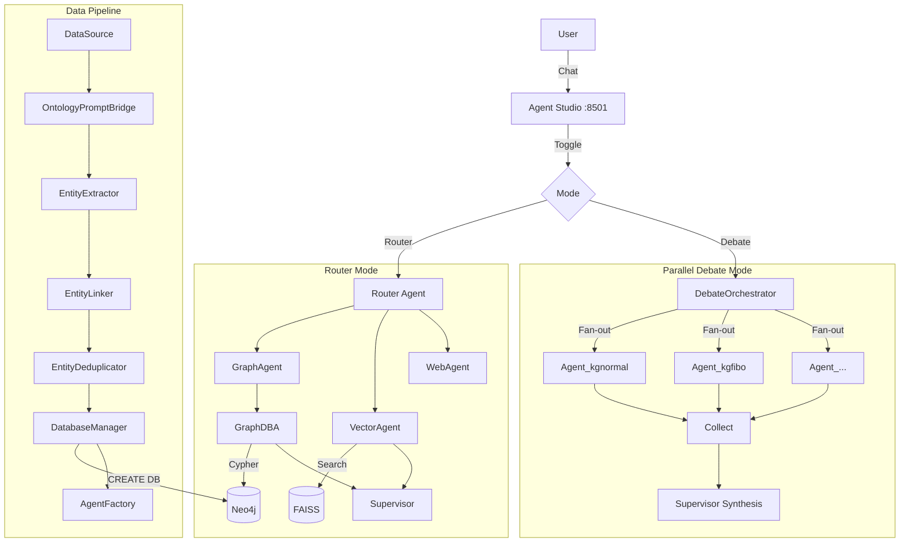

# SEOCHO

**Agent-Driven Knowledge Graph Platform**

[](https://github.com/tteon/seocho)
[]()

SEOCHO transforms unstructured data into structured knowledge graphs and provides dynamic, per-database agent pools with **Parallel Debate** orchestration for multi-perspective reasoning.

---

## How It Works

```
                         ┌── Agent_kgnormal ──┐
User Question ─► Debate  ├── Agent_kgfibo   ──┤─► Supervisor ─► Answer
                Orchestr. └── Agent_...      ──┘    Synthesis
```

**Data Pipeline** turns raw text into queryable knowledge graphs:
```
CSV/JSON/API → Ontology-Driven Extraction → Entity Linking → Deduplication → Neo4j
```

**Multi-Agent Reasoning** queries those graphs in parallel:
- Each Neo4j database gets its own agent with closure-bound tools
- All agents answer independently via `asyncio.gather()`
- Supervisor synthesizes a unified response

---

## Quick Start

### Prerequisites

- Docker & Docker Compose
- OpenAI API Key

### 1. Clone & Configure

```bash
git clone https://github.com/tteon/seocho.git
cd seocho

cp .env.example .env
# Edit .env — set OPENAI_API_KEY=sk-...
```

### 2. Start Services

```bash
make up
```

### 3. Open Agent Studio

Go to **http://localhost:8501** — chat with agents and watch the trace flow in real-time.

Toggle **"Parallel Debate Mode"** to switch between single-agent routing and multi-agent debate.

### 4. Try the API

```bash
# Router mode (single agent)
curl -X POST http://localhost:8001/run_agent \
  -H "Content-Type: application/json" \
  -d '{"query": "What entities exist in the knowledge graph?"}'

# Debate mode (all DB agents in parallel)
curl -X POST http://localhost:8001/run_debate \
  -H "Content-Type: application/json" \
  -d '{"query": "Compare financial entities across all databases"}'
```

---

## Access Points

| Service | URL |
|---------|-----|
| Agent Studio | http://localhost:8501 |
| API Docs (Swagger) | http://localhost:8001/docs |
| Neo4j Browser | http://localhost:7474 |

**Neo4j credentials**: `neo4j` / `password`

---

## Observability with Opik

SEOCHO includes [Opik](https://github.com/comet-ml/opik) for LLM tracing, evaluation, and agent visualization. It runs as an opt-in Docker Compose profile:

```bash
# Start with Opik
make opik-up

# Access Opik dashboard
open http://localhost:5173
```

Opik auto-traces all OpenAI calls, agent executions, and debate orchestration with parent-child span trees. No code changes needed — it's baked into the pipeline.

```bash
# Stop Opik (core services keep running)
make opik-down
```

---

## Architecture



---

## Project Structure

```
seocho/
├── extraction/                # Core ETL + multi-agent system
│   ├── agent_server.py        #   FastAPI: /run_agent, /run_debate
│   ├── pipeline.py            #   Extract → Link → Dedup → Schema → Load
│   ├── debate.py              #   Parallel Debate orchestrator
│   ├── agent_factory.py       #   Per-DB agent creation (closure-bound tools)
│   ├── shared_memory.py       #   Request-scoped agent shared memory
│   ├── data_source.py         #   DataSource ABC (CSV, JSON, Parquet, API)
│   ├── ontology_prompt_bridge.py  # Ontology → LLM prompt injection
│   ├── deduplicator.py        #   Embedding cosine-similarity dedup
│   ├── database_manager.py    #   Neo4j DB provisioning
│   ├── config.py              #   Centralized config + DatabaseRegistry
│   ├── tracing.py             #   Opik integration (opt-in)
│   ├── ontology/              #   Ontology definitions (base, loaders)
│   └── conf/                  #   Hydra configs (prompts, schemas)
├── evaluation/                # Streamlit Agent Studio (PoC demo)
├── semantic/                  # Semantic analysis service
├── demos/                     # Agent and tracing demos
├── docs/
│   ├── ARCHITECTURE.md        #   Detailed architecture reference
│   ├── QUICKSTART.md          #   5-minute setup guide
│   └── ROADMAP.md             #   Development roadmap
├── docker-compose.yml         # Core + Opik (profile: opik)
├── CLAUDE.md                  # AI agent developer guide (11 rules)
└── .env.example               # Environment template
```

---

## API Reference

| Endpoint | Method | Description |
|----------|--------|-------------|
| `/run_agent` | POST | Router mode — single-agent routing |
| `/run_debate` | POST | Debate mode — all DB agents in parallel |
| `/databases` | GET | List registered Neo4j databases |
| `/agents` | GET | List active DB-bound agents |

**Request body** (`/run_agent`, `/run_debate`):
```json
{
  "query": "What companies are in the financial ontology?",
  "user_id": "user_default"
}
```

**Response** includes `response`, `trace_steps`, and (for debate) `debate_results` with per-agent answers.

---

## Key Concepts

### Ontology-Driven Extraction

Define your domain as a YAML ontology. The pipeline auto-generates LLM prompts from it:

```yaml
# extraction/conf/schemas/my_domain.yaml
graph_type: "MyDomain"
nodes:
  Company:
    description: "A business entity"
    properties:
      name: { type: STRING, constraint: UNIQUE }
  Person:
    description: "An individual"
    properties:
      name: { type: STRING, constraint: UNIQUE }
relationships:
  WORKS_AT:
    source: Person
    target: Company
```

### Dynamic Database Provisioning

Each dataset gets its own Neo4j database. Agents are auto-created per database:

```python
from database_manager import DatabaseManager

db_manager = DatabaseManager()
db_manager.provision_database("supplychain", ontology=my_ontology)
# → Neo4j database "supplychain" created, schema applied, agent spawned
```

### Parallel Debate Pattern

All registered DB agents answer the same question independently. The Supervisor synthesizes disagreements and agreements:

```
User: "What are the key financial entities?"

Agent_kgnormal: "Found 3 companies and 5 people..."
Agent_kgfibo:   "Found 2 bonds and 1 issuer..."

Supervisor: "Across both databases, the key entities are..."
```

---

## Development

```bash
# Run tests
make test

# Lint & format
make lint
make format

# Load sample financial data
docker exec extraction-service python demos/data_mesh_mock.py
```

See [CLAUDE.md](CLAUDE.md) for coding rules, patterns, and module reference.
See [docs/ARCHITECTURE.md](docs/ARCHITECTURE.md) for detailed architecture.

---

## Contributing

We welcome contributions for new ontology mappings, agent tools, and pipeline enhancements.
See [CONTRIBUTING.md](CONTRIBUTING.md) for guidelines.

## License

MIT License.
