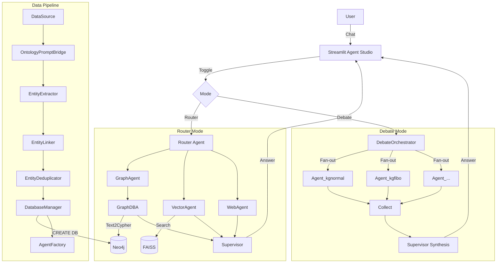

# SEOCHO (서초)

**Agent-Driven Knowledge Graph Platform**

[](https://github.com/tteon/seocho)
[]()

SEOCHO transforms unstructured data into structured knowledge graphs and provides dynamic, per-database agent pools with **Parallel Debate** orchestration for multi-perspective reasoning.

---

## Architecture



## Core Capabilities

### Data Pipeline
- **DataSource**: Universal ingestion from CSV, JSON, Parquet, and REST APIs
- **Ontology-Driven Extraction**: LLM prompts are generated from ontology definitions, not hard-coded
- **Semantic Deduplication**: Embedding cosine similarity (threshold 0.92) merges "SpaceX" and "Space Exploration Technologies Corp"
- **Dynamic DB Provisioning**: Each dataset gets its own Neo4j database with schema auto-applied

### Multi-Agent Reasoning
- **Router Mode**: Classic single-agent routing (Graph, Vector, Web, Table specialists)
- **Parallel Debate Mode**: All DB agents answer independently via `asyncio.gather()`, then Supervisor synthesizes
- **SharedMemory**: Request-scoped query caching prevents duplicate Cypher execution across agents
- **AgentFactory**: Per-DB agents with closure-bound tools — each agent only queries its own database

### Observability
- **Agent Studio**: Split-screen Streamlit UI with live trace visualization
- **Click-to-Detail**: Click any node in the flow graph to see full tool calls, Cypher queries, and reasoning
- **Trace Topology**: Fan-out / internal steps / collect / synthesis — not just linear chains

---

## Quick Start

### Prerequisites
- Docker & Docker Compose
- OpenAI API Key

### Setup
```bash
git clone https://github.com/tteon/seocho.git
cd seocho

cp .env.example .env
# Fill in OPENAI_API_KEY

make up
```

> Detailed setup: [docs/QUICKSTART.md](docs/QUICKSTART.md)

### Access Points
| Service | URL |
|---------|-----|
| Agent Studio | http://localhost:8501 |
| API Server | http://localhost:8001/docs |
| Neo4j Browser | http://localhost:7474 |
| DataHub UI | http://localhost:9002 |

### API Endpoints
| Endpoint | Method | Description |
|----------|--------|-------------|
| `/run_agent` | POST | Router mode (legacy) |
| `/run_debate` | POST | Parallel Debate mode |
| `/databases` | GET | List registered databases |
| `/agents` | GET | List active DB-bound agents |

---

## Project Structure

```
seocho/
├── extraction/              # Core ETL + agent system
│   ├── agent_server.py      # FastAPI endpoints
│   ├── pipeline.py          # DataSource → Extract → Link → Dedup → Load
│   ├── data_source.py       # DataSource ABC (File, API)
│   ├── ontology_prompt_bridge.py
│   ├── deduplicator.py      # Embedding similarity dedup
│   ├── database_manager.py  # Dynamic Neo4j DB provisioning
│   ├── agent_factory.py     # Per-DB agent creation
│   ├── shared_memory.py     # Request-scoped cache
│   ├── debate.py            # DebateOrchestrator
│   ├── config.py            # Centralized config + DatabaseRegistry
│   └── conf/                # Hydra configs (prompts, schemas)
├── evaluation/              # Streamlit Agent Studio
├── semantic/                # Semantic analysis service
├── demos/                   # Data Mesh demos
├── docs/
│   ├── ARCHITECTURE.md      # Full architecture reference
│   ├── QUICKSTART.md        # 5-minute setup guide
│   └── ROADMAP.md           # Development roadmap
├── CLAUDE.md                # Agent developer guide (10 rules + code flow)
├── AGENTS.md                # Agent collaboration guidelines
├── CONTRIBUTING.md          # Contribution guidelines
└── SECURITY.md              # Security policy
```

---

## Documentation

| Document | Audience | Content |
|----------|----------|---------|
| [CLAUDE.md](CLAUDE.md) | AI Agents / Developers | Code flow, 10 rules, MCP, patterns |
| [docs/ARCHITECTURE.md](docs/ARCHITECTURE.md) | Developers | Module map, data flow, trace topology |
| [docs/QUICKSTART.md](docs/QUICKSTART.md) | Users | 5-minute setup with troubleshooting |
| [AGENTS.md](AGENTS.md) | Contributors | Review guidelines, session workflow |
| [CONTRIBUTING.md](CONTRIBUTING.md) | Contributors | PR process, coding standards |

---

## Contributing

We welcome contributions for new ontology mappings, agent tools, and UI enhancements.
Please read [CONTRIBUTING.md](CONTRIBUTING.md) before getting started.

## License

MIT License.
