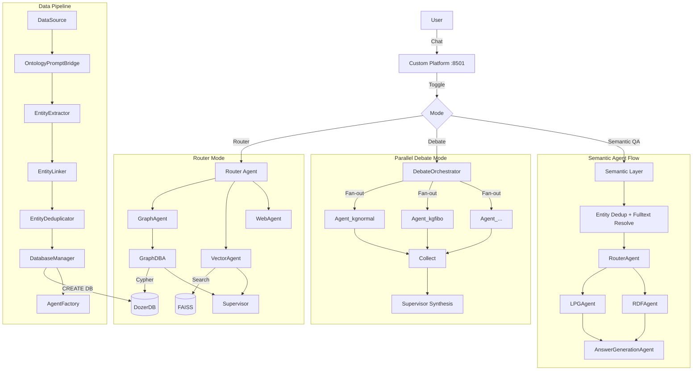

# SEOCHO

**Agent-Driven Knowledge Graph Platform**

[](https://github.com/tteon/seocho)
[]()

SEOCHO is for platform and data teams that want a graph-memory-style interface on top of a self-hosted knowledge graph runtime.

In 5 minutes: raw text -> graph-backed memory -> ask questions in one UI.

If you want a mem0-style developer entry point, start with [docs/PYTHON_INTERFACE_QUICKSTART.md](docs/PYTHON_INTERFACE_QUICKSTART.md).
If your question is "how do I put my own data into this?", go straight to [docs/APPLY_YOUR_DATA.md](docs/APPLY_YOUR_DATA.md).

When NOT to use SEOCHO:

- you only need keyword/vector search and do not need relationship reasoning
- you cannot run Docker services locally or in your target environment
- you need fully managed SaaS instead of self-hosted runtime control

## Run SEOCHO (5 Minutes)

1. Create `.env` with guided setup:

```bash
make setup-env
```

`OPENAI_API_KEY` is recommended for full extraction quality.
Without it, local fallback extraction still works for basic verification.

2. Start services:

```bash
make up
docker compose ps
```

Or use the local bootstrap CLI from the repository root:

```bash
pip install -e ".[dev]"
seocho serve
```

If `OPENAI_API_KEY` is unset or still using the placeholder from `.env.example`, `seocho serve` injects a local fallback key so the stack can still start for basic verification.

3. Open the platform UI: `http://localhost:8501`
4. Click `Load Sample & Ask`

Expected local surfaces:

- UI: `http://localhost:8501`
- backend API docs: `http://localhost:8001/docs`
- DozerDB browser: `http://localhost:7474`

If this flow succeeds, continue with [docs/QUICKSTART.md](docs/QUICKSTART.md).

## Getting Started

### Python Interface Quickstart

SEOCHO now ships a public Python SDK and CLI on top of the runtime APIs.

End-user install once the package is published:

```bash
pip install seocho
```

Repository contributor install:

```bash
pip install -e ".[dev]"
```

Quick script-style use:

```python
import seocho

seocho.configure(base_url="http://localhost:8001", workspace_id="default")
print(seocho.ask("What do you know about Alex?"))
```

Explicit client use:

```python
from seocho import Seocho

seocho = Seocho()

memory = seocho.add("Hi, I'm Alex. I love graph retrieval and ontology-aware reasoning.")
print(memory.memory_id)

results = seocho.search("What do you know about me?")
print(results[0].content)

answer = seocho.ask("What do you know about Alex?")
print(answer)
```

Developer-facing runtime calls are also available in the SDK:

```python
semantic = seocho.semantic(
    "Tell me about Neo4j",
    graph_ids=["kgnormal"],
    reasoning_mode=True,
    repair_budget=2,
)
advanced = seocho.advanced(
    "Compare what each graph knows about Alex.",
    graph_ids=["kgnormal", "kgfinance"],
)

print(semantic.route)
print(semantic.support.status)
print(semantic.strategy.executed_mode)
print(semantic.evidence.grounded_slots)
print(advanced.debate_state)
```

Recommended execution order:

- `ask` / `chat` for memory-first use
- `semantic` for graph-grounded retrieval
- inspect `support` / `strategy` / `evidence` before escalating
- `reasoning_mode=True` before reaching for debate
- `advanced()` only for explicit multi-agent comparison

Use the CLI:

```bash
seocho serve
seocho add "Alex manages the Seoul retail account."
seocho search "Who manages the Seoul retail account?"
seocho chat "What do you know about Alex?"
seocho graphs
seocho stop
```

Advanced developers can also manage semantic artifacts, local validation/diff/apply flows, and typed prompt context through the SDK/CLI. See [docs/PYTHON_INTERFACE_QUICKSTART.md](docs/PYTHON_INTERFACE_QUICKSTART.md).

For the fuller walkthrough, use [docs/PYTHON_INTERFACE_QUICKSTART.md](docs/PYTHON_INTERFACE_QUICKSTART.md).
For the shortest bring-your-own-data path, use [docs/APPLY_YOUR_DATA.md](docs/APPLY_YOUR_DATA.md).

To validate release artifacts locally before publishing:

```bash
pip install -e ".[dev]"
uv build
twine check dist/*
```

## Choose Your Track

Track A - I just want to run it:

- start with [docs/QUICKSTART.md](docs/QUICKSTART.md)
- use [docs/APPLY_YOUR_DATA.md](docs/APPLY_YOUR_DATA.md) to ingest your own records
- use [docs/TUTORIAL_FIRST_RUN.md](docs/TUTORIAL_FIRST_RUN.md) for manual API verification
- use [docs/BEGINNER_PIPELINES_DEMO.md](docs/BEGINNER_PIPELINES_DEMO.md) for staged demo scripts

Track B - I want to embed/extend it:

- read [docs/ARCHITECTURE.md](docs/ARCHITECTURE.md)
- read [docs/GRAPH_MEMORY_API.md](docs/GRAPH_MEMORY_API.md)
- read [docs/GRAPH_RAG_AGENT_HANDOFF_SPEC.md](docs/GRAPH_RAG_AGENT_HANDOFF_SPEC.md)
- use [docs/OPEN_SOURCE_PLAYBOOK.md](docs/OPEN_SOURCE_PLAYBOOK.md)
- implement against runtime APIs in [docs/WORKFLOW.md](docs/WORKFLOW.md)

## Codex Automation

SEOCHO includes two scheduled Codex draft-PR workflows.

- daily maintenance:
  - workflow: `.github/workflows/daily-codex-maintenance.yml`
  - prompt: `.github/codex/prompts/daily-maintenance-pr.md`
  - skill: `.agents/skills/daily-maintenance-pr/SKILL.md`
- periodic repository review:
  - workflow: `.github/workflows/periodic-codex-review.yml`
  - prompt: `.github/codex/prompts/periodic-review-pr.md`
  - skill: `.agents/skills/periodic-review-pr/SKILL.md`

Required repository secrets for Codex PR automation:

- `OPENAI_API_KEY`
- `SEOCHO_GITHUB_APP_ID`
- `SEOCHO_GITHUB_APP_PRIVATE_KEY`

Both workflows open or update draft PRs through a GitHub App token. They are
review-only by design and do not auto-merge.

The daily workflow stays in the small maintenance lane. The periodic review
workflow is allowed to pick one bounded refactor or small developer-facing
improvement, but it still uses a single draft PR branch and avoids large
speculative features.

Codex-generated PR bodies are expected to include:

- `Feature`
- `Why`
- `Design`
- `Expected Effect`
- `Impact Results`
- `Validation`
- `Risks`

## Comment-Based Merge

SEOCHO can also merge a reviewed pull request from a maintainer comment.

- workflow: `.github/workflows/pr-comment-merge.yml`
- trigger: comment exactly `/go` on an open non-draft PR
- authorization: commenter must have repository permission level `write`,
  `maintain`, or `admin`
- merge method: squash merge

This is intended for reviewed PRs after a human decision to land them. It does
not bypass branch protection or required checks.

## Python Package Publishing

SEOCHO now includes a GitHub Actions publish workflow for the Python package.

- workflow: `.github/workflows/publish-python-package.yml`
- manual smoke target: `workflow_dispatch` to `testpypi`
- production target: `workflow_dispatch` to `pypi` or push a `v*` tag

The workflow builds the package, runs `twine check`, and then publishes through
PyPI trusted publishing. Configure the `testpypi` and `pypi` environments in
GitHub and register this repository as a trusted publisher in each package
index before using the publish jobs.

On tag-triggered production publishes, the workflow also checks that the git
tag matches `project.version` from `pyproject.toml`.

## Product Baseline

- Runtime: **OpenAI Agents SDK**
- Trace/Eval (optional): **Opik**
- Graph DB (Bolt/Cypher compatible): **DozerDB**
- Tenancy: **Single-tenant MVP**, with `workspace_id` propagated for future expansion

## Design Philosophy (Builder Context)

1. Extract domain rules and high-value semantics from heterogeneous data into a SHACL-like semantic layer.
2. Preserve extracted data in table-first form and build ontology artifacts (`.ttl` and related files) as merge-time decision evidence.
3. Use entity extraction/linking with ontology-aware prompting (`prompt + ontology` context to LLMs) to convert related records into graph structures.
4. Maintain a 1:1 mapping between graph instances and graph agents.
5. Keep router agent as default request entry, selecting graph instances that can answer user intent.
6. Operate router/graph-agent interaction under supervisor-style orchestration, with ontology metadata driving query-to-graph allocation.
7. Treat agent-layer telemetry as first-class data and track every flow with Opik.
8. Build a governed enterprise vocabulary layer from extraction + SHACL outputs so keyword-sensitive graph retrieval is resilient.

Additional viewpoints adopted by SEOCHO:

- **Provenance-first governance**: every extracted fact and rule should remain auditable to source chunk/document.
- **Confidence-aware control**: routing/disambiguation decisions should expose confidence and support deterministic overrides.
- **Contract-first DAG integration**: backend emits strict topology metadata (e.g., `node_id`, `parent_id`, `parent_ids`) so frontend trace canvas renders real execution graph, not heuristic layout.
- **Closed-loop readiness**: semantic quality is operationalized via `/rules/assess` (validation + exportability) before rule promotion.
- **Versioned ontology lifecycle**: ontology/rule artifacts are treated as versioned control-plane assets, not ad-hoc runtime state.
- **Governed vocabulary access**: semantic artifacts evolve through `draft -> approved -> deprecated`, with global baseline terms plus `workspace_id`-scoped overrides.

## Planes

### Control Plane

- Agent routing/instructions and runtime policies
- Deployment and quality gates
- Decision governance (`docs/decisions/*`)

### Data Plane

- Ingestion/extraction/linking/dedup
- SHACL-like rule inference and validation
- Graph load/query against DozerDB

---

## How It Works

```
                         ┌── Agent_kgnormal ──┐
User Question ─► Debate  ├── Agent_kgfibo   ──┤─► Supervisor ─► Answer
                Orchestr. └── Agent_...      ──┘    Synthesis

User Question ─► Semantic Layer(entity extract/dedup/fulltext) ─► Router
             └──────────────────────────────────────────────────► LPG Agent
                                                                ► RDF Agent
                                                                ► Answer Generation Agent
```

**Data Pipeline** turns heterogeneous raw material into queryable knowledge graphs:
```
PDF/CSV/JSON/Text → Parse to text → LLM 3-pass (Ontology + SHACL + Entity) → Relatedness gate + Linking → DozerDB
```

**Multi-Agent Reasoning** queries those graphs in parallel:
- Each graph database gets its own agent with closure-bound tools
- All agents answer independently via `asyncio.gather()`
- Supervisor synthesizes a unified response
- Backend emits topology metadata for DAG-grade UI trace rendering
- Optional semantic route uses 4-agent flow:
  - `RouterAgent`
  - `LPGAgent`
  - `RDFAgent`
  - `AnswerGenerationAgent`

**Rule Constraints (SHACL-like)** infer validation rules from extracted graph data:
- infer required/datatype/enum/range rules from dataset patterns
- annotate node-level constraint violations
- export rule profile for downstream graph governance

---

## Run Paths

Recommended onboarding order:

1. [docs/QUICKSTART.md](docs/QUICKSTART.md)
2. [docs/TUTORIAL_FIRST_RUN.md](docs/TUTORIAL_FIRST_RUN.md)
3. [docs/BEGINNER_PIPELINES_DEMO.md](docs/BEGINNER_PIPELINES_DEMO.md)

If you want to verify the backend directly instead of using the UI first:

Store a memory:

```bash
curl -sS -X POST http://localhost:8001/api/memories \
  -H "Content-Type: application/json" \
  -d '{
    "workspace_id":"default",
    "content":"Alice manages the Seoul retail account.",
    "metadata":{"source":"readme"}
  }' | jq .
```

Ask from memories:

```bash
curl -sS -X POST http://localhost:8001/api/chat \
  -H "Content-Type: application/json" \
  -d '{
    "workspace_id":"default",
    "message":"Who manages the Seoul retail account?"
  }' | jq .
```

List graph targets:

```bash
curl -sS http://localhost:8001/graphs | jq .
```

Run a graph-scoped debate:

```bash
curl -sS -X POST http://localhost:8001/run_debate \
  -H "Content-Type: application/json" \
  -d '{
    "workspace_id":"default",
    "user_id":"alex",
    "query":"Compare what the baseline and finance graphs know about Alex.",
    "graph_ids":["kgnormal","kgfibo"]
  }' | jq .
```

---

## Access Points

| Service | URL |
|---------|-----|
| Custom Chat Platform | http://localhost:8501 |
| API Docs (Swagger) | http://localhost:8001/docs |
| Public Memory API Base | http://localhost:8001 |
| Graph DB Browser (DozerDB) | http://localhost:7474 |

**Graph DB credentials**: `neo4j` / `password`

---

## Optional Observability (Opik)

Use [Opik](https://github.com/comet-ml/opik) only after base onboarding succeeds. It is optional and runs as a Docker Compose profile:

```bash
# Start with Opik
make opik-up

# Access Opik dashboard
open http://localhost:5173
```

Opik auto-traces all OpenAI calls, agent executions, and debate orchestration with parent-child span trees. No code changes needed — it's baked into the pipeline.

```bash
# Stop Opik (core services keep running)
make opik-down
```

---

## Architecture


```mermaid
graph TD
    User[User] -->|Chat| UI[Custom Platform :8501]
    UI -->|Toggle| Mode{Mode}

    Mode -->|Router| Router[Router Agent]
    Mode -->|Debate| Debate[DebateOrchestrator]
    Mode -->|Semantic QA| Sem[Semantic Layer]

    subgraph Router_Mode[Router Mode]
        Router --> Graph[GraphAgent]
        Router --> Vector[VectorAgent]
        Router --> Web[WebAgent]
        Graph --> DBA[GraphDBA]
        DBA -->|Cypher| DozerDB[(DozerDB)]
        Vector -->|Search| FAISS[(FAISS)]
        DBA --> Sup1[Supervisor]
        Vector --> Sup1
    end

    subgraph Debate_Mode[Parallel Debate Mode]
        Debate -->|Fan-out| A1[Agent_kgnormal]
        Debate -->|Fan-out| A2[Agent_kgfibo]
        Debate -->|Fan-out| AN[Agent_...]
        A1 --> Collect[Collect]
        A2 --> Collect
        AN --> Collect
        Collect --> Sup2[Supervisor Synthesis]
    end

    subgraph Semantic_Mode[Semantic Agent Flow]
        Sem --> DedupResolve[Entity Dedup + Fulltext Resolve]
        DedupResolve --> Route2[RouterAgent]
        Route2 --> LPG[LPGAgent]
        Route2 --> RDF[RDFAgent]
        LPG --> Ans[AnswerGenerationAgent]
        RDF --> Ans
    end

    subgraph Pipeline[Data Pipeline]
        DS[DataSource] --> Bridge[OntologyPromptBridge]
        Bridge --> Extract[EntityExtractor]
        Extract --> Link[EntityLinker]
        Link --> Dedup[EntityDeduplicator]
        Dedup --> DBM[DatabaseManager]
        DBM -->|CREATE DB| DozerDB
        DBM --> AF[AgentFactory]
    end
```

---

## Project Structure

```
seocho/
├── extraction/                # Core ETL + multi-agent system
│   ├── agent_server.py        #   FastAPI: /run_agent, /run_debate, /run_agent_semantic
│   ├── pipeline.py            #   Extract → Link → Dedup → Schema → Load
│   ├── debate.py              #   Parallel Debate orchestrator
│   ├── agent_factory.py       #   Per-DB agent creation (closure-bound tools)
│   ├── semantic_query_flow.py #   Semantic route: entity resolve + router + LPG/RDF/Answer agents
│   ├── shared_memory.py       #   Request-scoped agent shared memory
│   ├── data_source.py         #   DataSource ABC (CSV, JSON, Parquet, API)
│   ├── ontology_prompt_bridge.py  # Ontology → LLM prompt injection
│   ├── deduplicator.py        #   Embedding cosine-similarity dedup
│   ├── database_manager.py    #   DozerDB provisioning
│   ├── config.py              #   Centralized config + env-first YAML loaders + DatabaseRegistry
│   ├── tracing.py             #   Opik integration (opt-in)
│   ├── ontology/              #   Ontology definitions (base, loaders)
│   └── conf/                  #   YAML configs (prompts, ingestion schemas)
├── evaluation/                # Custom frontend platform (FastAPI static app)
├── semantic/                  # Semantic analysis service
├── demos/                     # Agent and tracing demos
├── docs/
│   ├── ARCHITECTURE.md        #   Detailed architecture reference
│   ├── QUICKSTART.md          #   5-minute setup guide
│   └── ROADMAP.md             #   Development roadmap
├── docker-compose.yml         # Core + Opik (profile: opik)
├── CLAUDE.md                  # AI agent execution guide (source-of-truth workflow)
├── AGENTS.md                  # concise agent operating rules for this repo
└── .env.example               # Environment template
```

---

## API Reference

| Endpoint | Method | Description |
|----------|--------|-------------|
| `/run_agent` | POST | Router mode — single-agent routing |
| `/run_agent_semantic` | POST | Semantic entity-resolution mode (router/LPG/RDF/answer) |
| `/run_debate` | POST | Debate mode — all DB agents in parallel |
| `/indexes/fulltext/ensure` | POST | Ensure fulltext index for semantic entity resolution |
| `/health/runtime` | GET | Runtime health (API, DozerDB reachability, Agent SDK adapter) |
| `/health/batch` | GET | Batch/pipeline health (separate from runtime API readiness) |
| `/platform/chat/send` | POST | Custom platform chat endpoint |
| `/platform/ingest/raw` | POST | Ingest user raw material records (`text`/`csv`/`pdf`) into target graph DB |
| `/platform/chat/session/{session_id}` | GET | Read platform chat session |
| `/platform/chat/session/{session_id}` | DELETE | Reset platform chat session |
| `/rules/infer` | POST | Infer SHACL-like rule profile from graph payload |
| `/rules/validate` | POST | Validate graph payload against inferred/provided rules |
| `/rules/assess` | POST | Practical readiness assessment (validation + exportability) |
| `/rules/profiles` | POST | Save a named rule profile for a workspace (durable SQLite registry) |
| `/rules/profiles` | GET | List saved rule profiles in a workspace |
| `/rules/profiles/{profile_id}` | GET | Read one saved rule profile |
| `/rules/export/cypher` | POST | Export rule profile to DozerDB Cypher constraints |
| `/rules/export/shacl` | POST | Export rule profile to SHACL-compatible artifact (Turtle + shape JSON) |
| `/semantic/artifacts/drafts` | POST | Save ontology/SHACL candidates as draft artifact |
| `/semantic/artifacts` | GET | List semantic artifacts (`draft`/`approved`/`deprecated`) |
| `/semantic/artifacts/{artifact_id}` | GET | Read one semantic artifact |
| `/semantic/artifacts/{artifact_id}/approve` | POST | Approve draft artifact for runtime `approved_only` policy |
| `/semantic/artifacts/{artifact_id}/deprecate` | POST | Deprecate approved artifact to remove it from active vocabulary baseline |
| `/databases` | GET | List registered graph databases |
| `/agents` | GET | List active DB-bound agents |

**Request body** (`/run_agent`, `/run_debate`):
```json
{
  "query": "What companies are in the financial ontology?",
  "user_id": "user_default",
  "workspace_id": "default"
}
```

**Request body** (`/run_agent_semantic`):
```json
{
  "query": "What is DozerDB connected to?",
  "workspace_id": "default",
  "databases": ["kgnormal", "kgfibo"],
  "entity_overrides": [
    {
      "question_entity": "DozerDB",
      "database": "kgnormal",
      "node_id": 101,
      "display_name": "DozerDB"
    }
  ]
}
```

**Request body** (`/platform/chat/send`):
```json
{
  "session_id": "sess_001",
  "message": "DozerDB와 GraphRAG 연결을 설명해줘",
  "mode": "semantic",
  "workspace_id": "default",
  "databases": ["kgnormal", "kgfibo"]
}
```

**Request body** (`/rules/infer`):
```json
{
  "workspace_id": "default",
  "graph": {
    "nodes": [{"id": "1", "label": "Company", "properties": {"name": "Acme"}}],
    "relationships": []
  }
}
```

**Request body** (`/rules/assess`):
```json
{
  "workspace_id": "default",
  "graph": {
    "nodes": [
      {"id": "1", "label": "Company", "properties": {"name": "Acme", "employees": 100}},
      {"id": "2", "label": "Company", "properties": {"name": "", "employees": "many"}}
    ],
    "relationships": []
  }
}
```

**Response** includes `response`, `trace_steps`, and (for debate) `debate_results` with per-agent answers.
Debate responses also expose `agent_statuses` (`ready` or `degraded`) and `degraded` for partial-availability handling.
When all debate agents are unavailable (`debate_state=blocked`), platform orchestration falls back to semantic mode.

---

## Key Concepts

### Ontology-Driven Extraction

Define your domain as a YAML ontology. The pipeline auto-generates LLM prompts from it:

```yaml
# extraction/conf/schemas/my_domain.yaml
graph_type: "MyDomain"
nodes:
  Company:
    description: "A business entity"
    properties:
      name: { type: STRING, constraint: UNIQUE }
  Person:
    description: "An individual"
    properties:
      name: { type: STRING, constraint: UNIQUE }
relationships:
  WORKS_AT:
    source: Person
    target: Company
```

### Dynamic Database Provisioning

Each dataset gets its own DozerDB database. Agents are auto-created per database:

```python
from database_manager import DatabaseManager

db_manager = DatabaseManager()
db_manager.provision_database("supplychain", ontology=my_ontology)
# → DozerDB database "supplychain" created, schema applied, agent spawned
```

### Parallel Debate Pattern

All registered DB agents answer the same question independently. The Supervisor synthesizes disagreements and agreements:

```
User: "What are the key financial entities?"

Agent_kgnormal: "Found 3 companies and 5 people..."
Agent_kgfibo:   "Found 2 bonds and 1 issuer..."

Supervisor: "Across both databases, the key entities are..."
```

### SHACL-like Rule Constraint Inference

Pipeline can infer and apply lightweight constraints after deduplication.

```yaml
# extraction/conf/config.yaml
enable_rule_constraints: true
```

Generated output includes:

- `rule_profile`: inferred rules
- `rule_validation_summary`: pass/fail node counts
- `nodes[*].rule_validation`: per-node violations
- `/rules/assess.practical_readiness`: readiness status/score and actionable recommendations

Rule profiles can now be exported directly for governance rollout:

- `/rules/export/cypher` for DozerDB constraints (`required` + `datatype`) and validation query hooks (`enum` + `range`)
- `/rules/export/shacl` for SHACL-compatible Turtle + shape JSON
- rule profile registry persists in SQLite under `RULE_PROFILE_DIR/rule_profiles.db` (or explicit DB path), with workspace-scoped versioning/retention

Runtime ingest artifact policy:

- `auto`: apply newly extracted ontology/SHACL candidates immediately
- `draft_only`: store candidates as draft (`semantic_artifacts`) and do not apply to rule profile
- `approved_only`: apply only caller-provided `approved_artifacts`
- for server-side resolution, pass `approved_artifact_id` in `/platform/ingest/raw`
- runtime ingest response also includes `vocabulary_candidate` and `draft_vocabulary_candidate`

Practical run:

```bash
curl -s -X POST http://localhost:8001/rules/assess \
  -H "Content-Type: application/json" \
  -d @sample_graph_payload.json | jq '.practical_readiness'
```

Local demo script:

```bash
python scripts/rules/shacl_practical_demo.py
```

### Enterprise Vocabulary Layer (Planned Direction)

SEOCHO is extending semantic governance to a managed enterprise vocabulary layer for keyword-sensitive graph retrieval.

- candidate generation: combine entity extraction/linking output with SHACL-like rule artifacts
- lifecycle governance: manage vocabulary assets as `draft -> approved -> deprecated`
- access model: use global approved vocabulary as default and allow `workspace_id`-scoped overrides
- runtime behavior: keep request-path resolver lightweight (lookup/expansion only), while heavy ontology reasoning remains offline (Owlready2 path)

---

## Development

```bash
# Run tests
make test
make test-integration
make e2e-smoke

# Lint & format
make lint
make format

# Agent docs baseline lint
scripts/pm/lint-agent-docs.sh

# Install repo-managed git hooks (pre-commit bd flush guard)
scripts/pm/install-git-hooks.sh

# Load sample financial data
docker exec extraction-service python demos/data_mesh_mock.py
```

See [CLAUDE.md](CLAUDE.md) for coding rules, patterns, and module reference.
See [docs/ARCHITECTURE.md](docs/ARCHITECTURE.md) for detailed architecture.
See [docs/TUTORIAL_FIRST_RUN.md](docs/TUTORIAL_FIRST_RUN.md) for first end-to-end run.
See [docs/BEGINNER_PIPELINES_DEMO.md](docs/BEGINNER_PIPELINES_DEMO.md) for beginner-friendly 4-stage demo pipelines.
See [docs/WORKFLOW.md](docs/WORKFLOW.md) for control/data plane workflow.
See [docs/PHILOSOPHY.md](docs/PHILOSOPHY.md) for the design philosophy charter and operating principles.
See [docs/PHILOSOPHY_FEASIBILITY_REVIEW.md](docs/PHILOSOPHY_FEASIBILITY_REVIEW.md) for expert-panel feasibility criteria and execution gates.
See [docs/GRAPH_MODEL_STRATEGY.md](docs/GRAPH_MODEL_STRATEGY.md) for graph representation strategy.
See [docs/SHACL_PRACTICAL_GUIDE.md](docs/SHACL_PRACTICAL_GUIDE.md) for practical SHACL-like rollout guidance.
See [docs/ISSUE_TASK_SYSTEM.md](docs/ISSUE_TASK_SYSTEM.md) for sprint/roadmap issue-task operations.
See [docs/BEADS_OPERATING_MODEL.md](docs/BEADS_OPERATING_MODEL.md) for task-tracked delivery workflow.
See [docs/CONTEXT_GRAPH_BLUEPRINT.md](docs/CONTEXT_GRAPH_BLUEPRINT.md) for context graph rollout.
See [docs/OPEN_SOURCE_PLAYBOOK.md](docs/OPEN_SOURCE_PLAYBOOK.md) for structured open-source onboarding and extension workflow.
See [docs/decisions/DECISION_LOG.md](docs/decisions/DECISION_LOG.md) for architecture decision history.
See [docs/README.md](docs/README.md) for active-vs-archive doc map.

For seocho.blog sync, keep `README.md` and `docs/*` aligned as the source of truth.

---

## Contributing

We welcome contributions for new ontology mappings, agent tools, and pipeline enhancements.
Start with [CONTRIBUTING.md](CONTRIBUTING.md), then follow the onboarding checklist in [docs/OPEN_SOURCE_PLAYBOOK.md](docs/OPEN_SOURCE_PLAYBOOK.md).

## License

This project is licensed under the MIT License. See [LICENSE](LICENSE).
