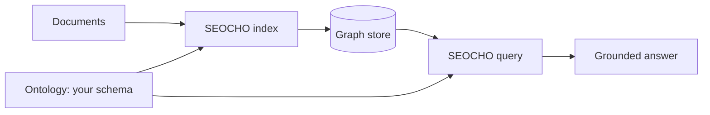

# SEOCHO

**Ontology-aligned middleware for agentic graph memory.**

[](https://pypi.org/project/seocho/)
[](https://pypi.org/project/seocho/)
[](https://pypi.org/project/seocho/)
[](LICENSE)
[](https://seocho.blog/docs/)
[](QUICKSTART.md)
[](examples/)

SEOCHO sits between your agents and your graph database. You define the domain
ontology once, then use the same contract to ingest documents, shape graph
writes, generate schema-aware queries, and produce answers with traceable
evidence.

In one sentence: SEOCHO turns your ontology into the operating contract for
graph memory, retrieval, and agent answers.

Under the hood, indexing and query runs emit ontology signals that SEOCHO
compiles into reviewable profiles, so an agent picks the right profile before
routing, text-to-Cypher, reasoning, or answer synthesis.


```mermaid
flowchart LR
    D["Documents"] --> I["SEOCHO index"]
    O["Ontology: your schema"] --> I
    O --> Q["SEOCHO query"]
    I --> G[("Graph store")]
    G --> Q
    Q --> A["Grounded answer"]
```

## Why Use It

Most agent memory systems start with chunks and prompts. SEOCHO starts with the
schema you want the system to respect.

Use SEOCHO when you need:

- document ingestion that writes typed graph facts, not only vector chunks
- answers that follow your ontology instead of drifting into free text
- Cypher/query generation that knows the graph schema it is allowed to use
- a local SDK path for development and a runtime API path for deployment
- visible artifacts, traces, and graph writes that can be inspected later

SEOCHO is not a hosted memory black box. It is a Python SDK and runtime shell
for teams that want to own the ontology, graph, and operational evidence.

## What You Build

```python
from seocho import Seocho, Ontology, NodeDef, RelDef, Property

ontology = Ontology(
    name="work",
    nodes={
        "Person": NodeDef(properties={"name": Property(str, unique=True)}),
        "Company": NodeDef(properties={"name": Property(str, unique=True)}),
    },
    relationships={
        "WORKS_AT": RelDef(source="Person", target="Company"),
    },
)

client = Seocho.local(ontology, llm="mara/MiniMax-M2.5")
client.add("Marie Curie worked at the University of Paris.")

print(client.ask("Where did Marie Curie work?"))
```

> Export your provider key first — SEOCHO recommends MARA: `export MARA_API_KEY=...`.
> Prefer another provider? Pass `llm="openai/gpt-4o"` (or `deepseek/…`, `kimi/…`)
> and export that provider's key instead.

That example creates a local ontology-aware graph memory. The same public
facade can later point at a running SEOCHO runtime:

```python
from seocho import Seocho

client = Seocho.remote("http://localhost:8001")
print(client.ask("What do we know about ACME?"))
```

## Five-Minute Quickstart

Install the local SDK path:

```bash
uv pip install "seocho[local]"
```

Run a complete example:

```bash
export MARA_API_KEY=...
uv run python examples/finance-compliance/quickstart.py --llm mara/MiniMax-M2.5
```

The finance-compliance example ingests six short mock filings into an embedded
local graph, then asks cross-document questions such as:

- Which regulations is Acme Financial Services subject to?
- What incidents have been reported?
- Which control evidence mitigates the incident?

Open [examples/finance-compliance/](examples/finance-compliance/) to inspect
the ontology, sample documents, and script.

Prefer the smallest possible hello world? Use [QUICKSTART.md](QUICKSTART.md).

### One YAML, one command

Skip Python entirely with a run spec — declare your ontology, documents, and
questions in YAML, then run the whole index → query → report flow:

```bash
export MARA_API_KEY=...
uv run seocho run examples/run/quickstart.yaml
```

From a repo checkout, prefix the CLI with `uv run` — uv resolves the project
environment and syncs dependencies for you, so there is no venv to activate.
If you installed SEOCHO into your own environment instead (`uv pip install
seocho`), drop the prefix and call `seocho run …` directly.

`uv run seocho run --init` writes a commented template. To compare N
configurations (models, enforcement modes, agent patterns) in one table,
declare them as variants of a Jinja2 template and run `uv run seocho sweep` —
see [docs/RUN_SPECS.md](docs/RUN_SPECS.md) for templates, sweeps, per-phase
models, and ontology enforcement modes.

## How SEOCHO Works

SEOCHO has three practical layers:

| Layer | Code | Job |
|---|---|---|
| Ontology | `src/seocho/ontology*.py` | Defines node types, relationships, properties, constraints, and governance metadata. |
| Indexing | `src/seocho/index/` | Turns files or text into ontology-shaped graph payloads with validation and provenance. |
| Querying | `src/seocho/query/` | Builds schema-aware Cypher, retrieves graph evidence, and synthesizes answers. |

The runtime layer in `runtime/` exposes the same contract over HTTP with policy
checks and `workspace_id` propagation. The legacy `extraction/` package remains
as an active compatibility/batch-service surface while runtime ownership is
being staged into `runtime/`.

## Choose A Mode

| Mode | Command or constructor | Best for |
|---|---|---|
| Local SDK | `Seocho.local(ontology)` | First run, notebooks, local development, embedded LadybugDB. |
| Explicit graph backend | `Seocho(ontology=..., graph_store=..., llm=...)` | Development against Neo4j/DozerDB or custom stores. |
| HTTP runtime client | `Seocho.remote("http://localhost:8001")` | Consuming a running SEOCHO service. |
| Local platform stack | `make setup-env && make up` | UI + API + DozerDB on one machine. |

Install choices. SEOCHO standardizes on [uv](https://docs.astral.sh/uv/) for
project management; the `uv pip` forms below work in any environment, and `pip`
is a drop-in if you are not on uv.

| Install (uv) | Use it when |
|---|---|
| `uv pip install seocho` | You only need the HTTP client. |
| `uv pip install "seocho[local]"` | You want the local SDK engine, agents, and embedded graph path. |
| `uv pip install "seocho[ontology]"` | You need offline ontology governance tools. |
| `uv sync --extra dev` (from a clone) | You are contributing to this repository. |

## What The Ontology Controls

| Stage | Effect |
|---|---|
| Ingestion | Entity and relationship types guide extraction. |
| Validation | Graph payloads are checked against schema and constraints. |
| Graph writes | Properties, uniqueness, provenance, and ontology context are recorded. |
| Querying | Cypher generation uses the active ontology and graph schema. |
| Runtime | Semantic artifacts, prompt context, traces, and `workspace_id` stay aligned. |

This is the core SEOCHO idea: one schema contract should govern what gets
written, what gets retrieved, and what an agent is allowed to claim.

## Runtime Stack

Run the local platform:

```bash
make setup-env
make up
```

Default local endpoints:

- UI: `http://localhost:8501`
- API docs: `http://localhost:8001/docs`
- DozerDB browser: `http://localhost:7474`

Runtime APIs live in `runtime/`. Shared SDK behavior lives in `src/seocho/`.
See [docs/RUNTIME_DEPLOYMENT.md](docs/RUNTIME_DEPLOYMENT.md) for the full
operator guide.

## Examples

| Example | What it shows |
|---|---|
| [examples/finance-compliance/](examples/finance-compliance/) | A small end-to-end ontology, sample docs, local graph ingest, and Q&A. |
| [examples/quickstart.ipynb](examples/quickstart.ipynb) | Notebook tour of ontology, indexing, provider setup, and tracing. |
| [examples/bring_your_data.ipynb](examples/bring_your_data.ipynb) | Pattern for using your own files and ontology. |
| [examples/finder/](examples/finder/) | FinDER/FIBO tutorials for graph RAG, RDF vs LPG, and private tracing. |

## Repository Map

| Path | Purpose |
|---|---|
| `src/seocho/` | Python SDK and canonical engine modules. |
| `runtime/` | Deployment shell, API wiring, runtime policy, memory service. |
| `extraction/` | Active extraction service and compatibility shims. |
| `examples/` | Runnable examples, notebooks, and small datasets. |
| `docs/` | Architecture, workflow, runtime, and user guides. |
| `tests/seocho/` | SDK and engine regression tests. |
| `extraction/tests/` | Runtime/extraction compatibility tests. |
| `website/` | Tracked Astro/Starlight docs site. |

For contributor placement rules, read
[docs/REPOSITORY_LAYOUT.md](docs/REPOSITORY_LAYOUT.md) and
[docs/MODULE_OWNERSHIP_MAP.md](docs/MODULE_OWNERSHIP_MAP.md).

## Learn More

Same order as the [docs onboarding path](docs/README.md), top to bottom:

| Need | Start here |
|---|---|
| Why SEOCHO exists | [docs/WHY_SEOCHO.md](docs/WHY_SEOCHO.md) |
| First run | [QUICKSTART.md](QUICKSTART.md) |
| Beginner walkthrough | [docs/BEGINNER_GUIDE.md](docs/BEGINNER_GUIDE.md) |
| Python SDK details | [docs/PYTHON_INTERFACE_QUICKSTART.md](docs/PYTHON_INTERFACE_QUICKSTART.md) |
| Bring your own data | [docs/APPLY_YOUR_DATA.md](docs/APPLY_YOUR_DATA.md) |
| File/artifact locations | [docs/FILES_AND_ARTIFACTS.md](docs/FILES_AND_ARTIFACTS.md) |
| Architecture | [docs/ARCHITECTURE.md](docs/ARCHITECTURE.md) |
| Runtime deployment | [docs/RUNTIME_DEPLOYMENT.md](docs/RUNTIME_DEPLOYMENT.md) |
| Contributing | [CONTRIBUTING.md](CONTRIBUTING.md) |
| Maintainer workflow | [docs/WORKFLOW.md](docs/WORKFLOW.md) |
| Issue and task system | [docs/ISSUE_TASK_SYSTEM.md](docs/ISSUE_TASK_SYSTEM.md) |
| Full docs site | [seocho.blog](https://seocho.blog) |

## FIBO Upstream Governance

SEOCHO keeps the official EDM Council FIBO repository as a pinned source
snapshot under `third_party/fibo`. Runtime code should not read the full FIBO
OWL/RDF tree directly; use compiled governance artifacts instead.

```bash
git submodule update --init --recursive
uv run python scripts/ontology/compile_fibo_snapshot.py \
  --source third_party/fibo \
  --curated-yaml-dir examples/finder/datasets/fibo_modules \
  --modules BE,FBC,FND,SEC \
  --out outputs/semantic_artifacts/fibo/latest
```

The compiler emits:

- `manifest.json` — upstream commit, imports, module/resource counts, snapshot hash
- `catalog.json` — runtime selector label/definition/IRI index
- `compatibility_report.json` — official FIBO vs SEOCHO curated LPG slice alignment
- `artifact_index.json` — source snapshot vs runtime artifact contract

FIBO updates should be promoted only after compatibility review and benchmark
gates over FinDER/private finance cases. Heavy OWL reasoning remains an offline
governance concern; request paths consume the compiled catalog/artifact.

## Development

```bash
git clone git@github.com:tteon/seocho.git
cd seocho
uv sync --extra dev
uv run python -m pytest tests/seocho/ -q
```

Before submitting broader changes, run:

```bash
bash scripts/ci/run_basic_ci.sh
```

## License

MIT - see [LICENSE](LICENSE).
