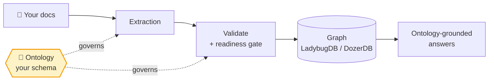

# SEOCHO

**Ontology-aligned middleware between your agents and your graph database.**

[](https://pypi.org/project/seocho/)
[](LICENSE)
[](https://seocho.blog/docs/)
[](https://deepwiki.com/tteon/seocho)
[](https://seocho.blog/docs/quickstart/)
[](https://seocho.blog/sdk/examples/)

You declare the ontology. You call `add()` and `ask()`.
SEOCHO keeps graph writes, semantic artifacts, and agent behavior aligned
to that one schema contract across local SDK and runtime paths.


```mermaid
flowchart LR
    D["📄 Your docs"] --> E["Extraction"]
    O{{"🧬 Ontology<br/>your schema"}} -.governs.-> E
    O -.governs.-> V
    E --> V["Validate<br/>+ readiness gate"]
    V --> G[("Graph<br/>LadybugDB / DozerDB")]
    G --> A["Ontology-grounded<br/>answers"]
    style O fill:#fef3c7,stroke:#f59e0b,stroke-width:2px
```

SEOCHO is a fit when:

- you need extraction, Cypher generation, and answers to stay in-schema
- you want one ontology to drive SDK, runtime, and graph contracts together
- you need files, artifacts, and traces to stay visible instead of disappearing
  behind a managed memory black box

Start here:

| If you want to... | Go here |
|---|---|
| get a first local success path | [Quickstart](docs/QUICKSTART.md) |
| see a runnable usecase demo | [Usecases](docs/USECASES.md) |
| bring your own ontology and files | [Apply Your Data](docs/APPLY_YOUR_DATA.md) |
| use the Python SDK directly | [Python SDK Quickstart](docs/PYTHON_INTERFACE_QUICKSTART.md) |
| inspect files, artifacts, and traces | [Files and Artifacts](docs/FILES_AND_ARTIFACTS.md) |
| understand the system design | [Architecture Deep Dive](docs/ARCHITECTURE.md) |

## Quick Start

```bash
uv pip install "seocho[local]"       # zero-config local SDK, embedded LadybugDB by default
# or: uv pip install "seocho[embedded]" # minimal embedded graph path
```

```python
from seocho import Seocho, Ontology, NodeDef, RelDef, Property

# 1. Define your schema
ontology = Ontology(
    name="my_domain",
    nodes={
        "Person":  NodeDef(properties={"name": Property(str, unique=True)}),
        "Company": NodeDef(properties={"name": Property(str, unique=True)}),
    },
    relationships={
        "WORKS_AT": RelDef(source="Person", target="Company"),
    },
)

# 2. Zero-config local client — uses embedded LadybugDB, no server needed
s = Seocho.local(ontology)

# 3. Index
s.add("Marie Curie worked at the University of Paris.")

# 4. Query
print(s.ask("Where did Marie Curie work?"))
```

Remote runtime client:

```python
from seocho import Seocho

client = Seocho.remote("http://localhost:8001")
print(client.ask("What do we know about ACME?"))
```

Run the local platform stack:

```bash
make setup-env
make up
```

## Install Paths

| Path | Install | What else you need |
|------|---------|--------------------|
| HTTP client mode | `pip install seocho` | a running SEOCHO runtime (`base_url=...`) |
| Local SDK engine | `pip install "seocho[local]"` | provider credentials; Neo4j/DozerDB only if you pass a Bolt URI |
| Repository development | `pip install -e ".[dev]"` | local clone + test/tooling deps |
| Offline ontology governance | `pip install "seocho[ontology]"` | local ontology files only |

- `pip install seocho` is intentionally thin — enough for HTTP client mode.
- `Seocho.local(ontology)` defaults to embedded LadybugDB at `.seocho/local.lbug`.
- DozerDB/Neo4j is the production graph path: pass `graph="bolt://..."` or construct `Neo4jGraphStore(...)` explicitly.
- The fastest full local stack is `make setup-env && make up`.

## Why SEOCHO

Built for graph-native teams that need a stronger contract between ontology,
runtime, and agent behavior.

- ontology-first, not prompt-first
- graph-native, not vector-only
- schemaless property graph plus agent-visible semantic overlay
- governed artifacts, not ad hoc schema drift
- local SDK authoring and runtime consumption on one contract

## Architecture Overview

Two planes share one ontology:

- **Data Plane** (`seocho/index/`) — files → extraction → validation → graph write
- **Control Plane** (`seocho/query/`) — ontology → prompt strategy → Cypher → answer synthesis
- **Ontology** (`seocho/ontology.py`) — single source of truth for both planes, and for the runtime artifact contract

The `Seocho` class is a thin public facade. Canonical engine logic lives under
`seocho/local_engine.py`, `seocho/client_remote.py`, and `seocho/client_bundle.py`
so the facade stays small. Runtime transport is `runtime/agent_server.py`;
shared runtime composition lives in `runtime/server_runtime.py`.

For the full story — control plane vs data plane, internal orchestration seams
(`DomainEvent`, `IngestionFacade`, `QueryProxy`, `AgentFactory`,
`AgentStateMachine`), and the staged `extraction/` → `runtime/` migration —
see [docs/ARCHITECTURE.md](docs/ARCHITECTURE.md) and
[docs/RUNTIME_PACKAGE_MIGRATION.md](docs/RUNTIME_PACKAGE_MIGRATION.md).

## Choose Your Runtime Shape

| Mode | Constructor | Best for |
|------|-------------|----------|
| HTTP client | `Seocho(base_url="http://localhost:8001", workspace_id="default")` | consume an existing runtime over HTTP |
| Embedded local | `Seocho.local(ontology)` | serverless hello world, SDK authoring, experiments |
| Explicit local engine | `Seocho(ontology=..., graph_store=..., llm=...)` | direct graph-store control |
| Local platform runtime | `make up` or `seocho serve` | UI + API + DozerDB on one machine |

Core parameters you will hit early:

- `base_url` — remote SEOCHO runtime root for HTTP client mode
- `workspace_id` — logical scope passed through runtime-facing requests
- `graph_store` — explicit graph store for local engine mode
- `reasoning_mode` + `repair_budget` — bounded semantic repair loop for hard questions

For production local engine, `Neo4jGraphStore` works against both Neo4j and DozerDB over Bolt:

```python
from seocho.store import Neo4jGraphStore

store = Neo4jGraphStore("bolt://localhost:7687", "neo4j", "password")
```

## Common Use Cases

### 1. Consume an existing SEOCHO runtime over HTTP

```python
from seocho import Seocho

client = Seocho(base_url="http://localhost:8001", workspace_id="default")
print(client.ask("What do we know about ACME?"))
```

### 2. Build locally against your own ontology with no graph server

```python
from seocho import Seocho, Ontology

client = Seocho.local(Ontology.from_jsonld("schema.jsonld"))
client.add("ACME acquired Beta in 2024.")
print(client.ask("Who did ACME acquire?", reasoning_mode=True, repair_budget=2))
```

### 3. Build locally against a production graph server

```python
from seocho import Seocho, Ontology
from seocho.store import Neo4jGraphStore, OpenAIBackend

client = Seocho(
    ontology=Ontology.from_jsonld("schema.jsonld"),
    graph_store=Neo4jGraphStore("bolt://localhost:7687", "neo4j", "password"),
    llm=OpenAIBackend(model="gpt-4o-mini"),
    workspace_id="default",
)
client.add("ACME acquired Beta in 2024.")
print(client.ask("Who did ACME acquire?", reasoning_mode=True, repair_budget=2))
```

### 4. Promote the same ontology into runtime artifacts

```python
artifacts = client.approved_artifacts_from_ontology()
prompt_context = client.prompt_context_from_ontology(
    instructions=["Prefer finance ontology labels and relationships."]
)
draft = client.artifact_draft_from_ontology(name="finance_core_v1")
```

### 5. Run the local platform stack with UI + API + graph DB

```bash
make setup-env
make up
```

- UI: `http://localhost:8501`
- API docs: `http://localhost:8001/docs`
- DozerDB browser: `http://localhost:7474`

See [docs/FILES_AND_ARTIFACTS.md](docs/FILES_AND_ARTIFACTS.md) for where
`schema.jsonld`, graph data, rule profiles, semantic artifacts, and traces live.

## What the Ontology Controls

| Stage | What happens |
|-------|-------------|
| **Extraction** | Entity types + relationships in LLM prompt |
| **Querying** | Schema-aware Cypher generation and repair prompts |
| **Validation** | SHACL shapes derived → catches type/cardinality errors |
| **Constraints** | UNIQUE/INDEX generated from ontology, applied to Neo4j |
| **Denormalization** | Cardinality rules determine safe flattening |
| **Glossary** | SKOS-style vocabulary terms, aliases, and hidden labels compiled into the ontology context identity |
| **Reasoning** | Optional low-quality retry re-extracts with ontology guidance |
| **Runtime parity** | Same ontology can be converted into approved semantic artifacts and typed prompt context |
| **Agent context** | Stable ontology context hash follows indexing, graph writes, query traces, and agent hand-off metadata |

Local SDK writes persist compact `_ontology_*` graph properties on nodes and
relationships. Queries and agent tools compare the active ontology context
hash with hashes in the graph and surface any mismatch as `ontology_context_mismatch`
in trace/tool metadata — a guardrail that signals when a graph may need
re-indexing under a new ontology profile.

## Key Features

```python
# Index a directory (supports .txt, .md, .csv, .json, .jsonl, .pdf)
s.index_directory("./my_data/")

# Category-aware extraction (8 filing-domain presets)
s.add(text, category="Financials")

# Query with reasoning mode
s.ask("question", reasoning_mode=True, repair_budget=2)

# Swappable LLM providers (OpenAI, DeepSeek, Kimi, Grok, Qwen)
from seocho.store import OpenAIBackend, DeepSeekBackend
llm = OpenAIBackend(model="gpt-4o-mini")

# Agent session — context persists across add/ask within one session
with s.session("my_analysis") as sess:
    sess.add("ACME acquired Beta in 2024.")
    sess.add("Beta provides risk analytics to ACME.")
    answer = sess.ask("What does ACME own or use?")

# Schema as code (JSON-LD canonical storage + SHACL export)
ontology.to_jsonld("schema.jsonld")
ontology = Ontology.from_jsonld("schema.jsonld")

# Ontology merge + diff (for migration)
combined = finance_onto.merge(legal_onto)
```

For the rest — experiment workbench, tracing backends, supervisor + hand-off
config, offline governance CLI, multi-ontology per database — see
[seocho.blog/sdk](https://seocho.blog/sdk/).

## SDK Package Structure

```
seocho/
├── index/              ← Data Plane: putting data IN
│   ├── pipeline.py     ← chunk → extract → validate → rule inference → write
│   ├── linker.py       ← embedding-based entity relatedness
│   └── file_reader.py  ← .txt/.md/.csv/.json/.jsonl/.pdf
├── query/              ← Control Plane: getting data OUT
│   ├── strategy.py     ← ontology → LLM prompt generation (cached)
│   └── cypher_builder.py ← deterministic Cypher from intent
├── store/              ← Storage backends
│   ├── graph.py        ← Neo4j/DozerDB + LadybugDB
│   ├── vector.py       ← FAISS / LanceDB
│   └── llm.py          ← OpenAI, DeepSeek, Kimi, Grok, Qwen
├── rules.py            ← SHACL-like rule inference + validation
├── ontology.py         ← Schema: JSON-LD + SHACL + merge + migration
├── session.py          ← Agent session: context cache + hand-off
├── agents.py           ← IndexingAgent / QueryAgent / Supervisor
├── local_engine.py     ← Local-mode orchestration behind the SDK facade
├── client_remote.py    ← HTTP transport behind the facade
├── client_bundle.py    ← Runtime-bundle glue behind the facade
└── client.py           ← Public SDK facade
```

## Three Ways to Use

### Python SDK
```python
from seocho import Seocho, Ontology, NodeDef, P
```

### CLI
```bash
seocho init                    # create ontology interactively
seocho index ./data/           # index files
seocho ask "your question"     # query
seocho status                  # graph stats
```

### Jupyter Notebook
```
examples/quickstart.ipynb
examples/bring_your_data.ipynb
examples/finance-compliance/quickstart.py
```

## LPG and RDF Support

```python
# LPG (default) — Cypher queries
onto = Ontology(name="finance", graph_model="lpg", ...)

# RDF — n10s Cypher (DozerDB + neosemantics)
onto = Ontology(name="fibo", graph_model="rdf",
                namespace="https://spec.edmcouncil.org/fibo/", ...)
```

## Documentation

| Doc | Description |
|-----|-------------|
| [seocho.blog](https://seocho.blog) | Full documentation site |
| [SDK Overview](https://seocho.blog/sdk/) | SDK features and quick start |
| [Ontology Guide](https://seocho.blog/sdk/ontology-guide/) | Schema design, JSON-LD, SHACL |
| [API Reference](https://seocho.blog/sdk/api-reference/) | Complete method reference |
| [docs/USECASES.md](docs/USECASES.md) | Runnable usecase demos |
| [docs/ARCHITECTURE.md](docs/ARCHITECTURE.md) | System architecture |
| [docs/FILES_AND_ARTIFACTS.md](docs/FILES_AND_ARTIFACTS.md) | Where ontology, rule, trace, and runtime files live |
| [docs/BENCHMARKS.md](docs/BENCHMARKS.md) | Private finance corpus and GraphRAG-Bench evaluation tracks |
| [docs/WORKFLOW.md](docs/WORKFLOW.md) | Operational workflow |
| [docs/ISSUE_TASK_SYSTEM.md](docs/ISSUE_TASK_SYSTEM.md) | Sprint/task governance |
| [CONTRIBUTING.md](CONTRIBUTING.md) | How to contribute |

## Observability

Pluggable tracing backends selectable at runtime or via `SEOCHO_TRACE_BACKEND`:

- `none` — no tracing; smallest surface
- `console` — ephemeral stdout for local dev
- `jsonl` — canonical neutral trace artifact; file-based retention
- `opik` — optional exporter (hosted or self-hosted); `SEOCHO_TRACE_OPIK_MODE=self_host` for private infra

Sensitive workloads: prefer `none` or `jsonl`. Prompts, retrieval evidence,
and metadata may appear in traces — route remote exporters through your
governance review. More detail at
[docs/FILES_AND_ARTIFACTS.md](docs/FILES_AND_ARTIFACTS.md).

## Server Mode (Platform Operators)

For the full platform with multi-agent debate, web UI, and Docker services:

```bash
make setup-env && make up
# UI: http://localhost:8501
# API: http://localhost:8001/docs
# DozerDB: http://localhost:7474
```

Default `make up` starts the core local stack: `neo4j`, `extraction-service`,
`evaluation-interface`. The legacy `semantic-service` is opt-in:

```bash
docker compose --profile legacy-semantic up -d semantic-service
```

Scheduled Codex workflows skip cleanly when `OPENAI_API_KEY` /
`SEOCHO_GITHUB_APP_ID` / `SEOCHO_GITHUB_APP_PRIVATE_KEY` are unset.
`Basic CI` remains the required repository check surface.

See [docs/QUICKSTART.md](docs/QUICKSTART.md) for the full server setup guide.

## Contributing

```bash
git clone git@github.com:tteon/seocho.git && cd seocho
pip install -e ".[dev]"
scripts/pm/install-git-hooks.sh
python -m pytest seocho/tests/ -q
```

Pick a usecase to build around: [docs/USECASES.md](docs/USECASES.md).
Full guide in [CONTRIBUTING.md](CONTRIBUTING.md).

## License

MIT — see [LICENSE](LICENSE).
