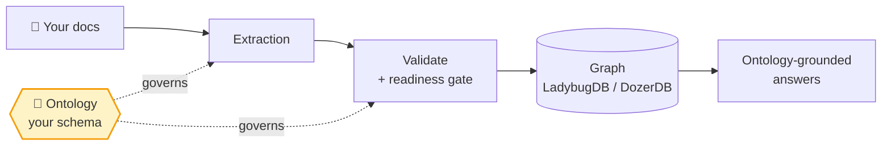

# SEOCHO

**Ontology-aligned middleware between your agents and your graph database.**

[](https://pypi.org/project/seocho/)
[](LICENSE)
[](https://seocho.blog/docs/)
[](https://deepwiki.com/tteon/seocho)
[](QUICKSTART.md)
[](https://seocho.blog/sdk/examples/)

You declare the ontology. You call `add()` and `ask()`.
SEOCHO keeps graph writes, semantic artifacts, and agent behavior aligned
to that one schema contract across local SDK and runtime paths.


```mermaid
flowchart LR
    D["📄 Your docs"] --> E["Extraction"]
    O{{"🧬 Ontology<br/>your schema"}} -.governs.-> E
    O -.governs.-> V
    E --> V["Validate<br/>+ readiness gate"]
    V --> G[("Graph<br/>LadybugDB / DozerDB")]
    G --> A["Ontology-grounded<br/>answers"]
    style O fill:#fef3c7,stroke:#f59e0b,stroke-width:2px
```

SEOCHO is a fit when:

- you need extraction, Cypher generation, and answers to stay in-schema
- you want one ontology to drive SDK, runtime, and graph contracts together
- you need files, artifacts, and traces to stay visible instead of disappearing
  behind a managed memory black box

## Quick Start

```bash
uv pip install "seocho[local]"       # zero-config local SDK, embedded LadybugDB by default
# or: uv pip install "seocho[embedded]" # minimal embedded graph path
```

```python
from seocho import Seocho, Ontology, NodeDef, RelDef, Property

# 1. Define your schema
ontology = Ontology(
    name="my_domain",
    nodes={
        "Person":  NodeDef(properties={"name": Property(str, unique=True)}),
        "Company": NodeDef(properties={"name": Property(str, unique=True)}),
    },
    relationships={
        "WORKS_AT": RelDef(source="Person", target="Company"),
    },
)

# 2. Zero-config local client — uses embedded LadybugDB, no server needed
s = Seocho.local(ontology)

# 3. Index
s.add("Marie Curie worked at the University of Paris.")

# 4. Query
print(s.ask("Where did Marie Curie work?"))
```

Remote runtime client:

```python
from seocho import Seocho

client = Seocho.remote("http://localhost:8001")
print(client.ask("What do we know about ACME?"))
```

`client.ask(...)` above is the HTTP chat convenience surface. It is not the
same execution engine as runtime `client.react(...)` or `client.advanced(...)`.

Run the local platform stack:

```bash
make setup-env
make up
```

## Install Paths

| Path | Install | What else you need |
|------|---------|--------------------|
| HTTP client mode | `pip install seocho` | a running SEOCHO runtime (`base_url=...`) |
| Local SDK engine | `pip install "seocho[local]"` | provider credentials; Neo4j/DozerDB only if you pass a Bolt URI |
| Repository development | `pip install -e ".[dev]"` | local clone + test/tooling deps |
| Offline ontology governance | `pip install "seocho[ontology]"` | local ontology files only |

- `pip install seocho` is intentionally thin — enough for HTTP client mode.
- `Seocho.local(ontology)` defaults to embedded LadybugDB at `.seocho/local.lbug`.
- DozerDB/Neo4j is the production graph path: pass `graph="bolt://..."` or construct `Neo4jGraphStore(...)` explicitly.
- The fastest full local stack is `make setup-env && make up`.
- `examples/quickstart.ipynb` reads provider keys from `.env`, stays on LadybugDB by default, and switches to Bolt-backed Neo4j/DozerDB only when both `NEO4J_URI` and `NEO4J_PASSWORD` are set.

## Execution Surfaces

The same `Seocho` facade exposes different execution engines. This is the
single most important thing to understand before benchmarking or comparing
providers.

| Surface | Where it runs | What it actually does | Tool use |
|------|-------------|------------------------|----------|
| `Seocho.local(...).ask(...)` | in-process local SDK | ontology-aware local query + answer synthesis | no runtime agent loop |
| `Seocho(base_url=...).ask(...)` | HTTP runtime | primary query facade; auto-routes to chat or semantic graph QA | not the explicit react/debate path |
| `client.semantic(...)` | HTTP runtime | advanced semantic graph QA with optional bounded repair | no agentic tool loop |
| `client.react(...)` | HTTP runtime | router agent path backed by the Agents runtime | yes |
| `client.advanced(...)` / `client.debate(...)` | HTTP runtime | multi-agent debate with semantic preflight + supervisor synthesis | yes |

If you want provider-native reasoning and tool-use comparisons, use
`client.react(...)` or `client.advanced(...)` against a running runtime. Do not
use local `ask()` as that benchmark target.

## Why SEOCHO

Built for graph-native teams that need a stronger contract between ontology,
runtime, and agent behavior.

- ontology-first, not prompt-first
- graph-native, not vector-only
- schemaless property graph plus agent-visible semantic overlay
- governed artifacts, not ad hoc schema drift
- local SDK authoring and runtime consumption on one contract

## Architecture Overview

Two planes share one ontology:

- **Data Plane** (`src/seocho/index/`) — files → extraction → validation → graph write
- **Control Plane** (`src/seocho/query/`) — ontology → prompt strategy → Cypher → answer synthesis
- **Ontology** (`src/seocho/ontology.py`) — single source of truth for both planes, and for the runtime artifact contract

The `Seocho` class is a thin public facade. Canonical engine logic lives under
`src/seocho/local_engine.py`, `src/seocho/client_remote.py`, and `src/seocho/client_bundle.py`
so the facade stays small. Runtime transport is `runtime/agent_server.py`;
shared runtime composition lives in `runtime/server_runtime.py`.

Local indexing now materializes a layered memory graph contract:
`Document -> DocumentVersion -> Section -> Chunk -> Entity`. When a
`vector_store` is provided to the local SDK client, chunk embeddings are
written with `chunk_id`/`document_id`/`version_id`/`section_path` metadata so
vector retrieval and graph provenance stay joinable. For callers that already
have ontology-shaped nodes and relationships, local mode also exposes
`client.add_graph(...)` to validate and materialize structured payloads without
re-running text extraction.

When you need to curate duplicate entities without losing provenance, local
mode can also record the observed graph into a tabular qualification store via
`qualification_store_path=...`. SQLite is the default mutable store; DuckDB is
available as an optional analytics backend. That enables
`qualify_graph() -> list_curation_cases() -> apply_curation_decision() ->
project_canonical_graph()` so entity identity decisions and canonical serving
projection stay separate from the raw observed ingest.

For the full story — control plane vs data plane, internal orchestration seams
(`DomainEvent`, `IngestionFacade`, `QueryProxy`, `AgentFactory`,
`AgentStateMachine`), and the staged `extraction/` → `runtime/` migration —
see [docs/ARCHITECTURE.md](docs/ARCHITECTURE.md) and
[docs/RUNTIME_PACKAGE_MIGRATION.md](docs/RUNTIME_PACKAGE_MIGRATION.md).

## Choose Your Runtime Shape

| Mode | Constructor | Best for |
|------|-------------|----------|
| HTTP client | `Seocho(base_url="http://localhost:8001", workspace_id="default")` | consume an existing runtime over HTTP |
| Embedded local | `Seocho.local(ontology)` | serverless hello world, SDK authoring, experiments |
| Explicit local engine | `Seocho(ontology=..., graph_store=..., llm=...)` | direct graph-store control |
| Local platform runtime | `make up` or `seocho serve` | UI + API + DozerDB on one machine |

Core parameters you will hit early:

- `base_url` — remote SEOCHO runtime root for HTTP client mode
- `workspace_id` — logical scope passed through runtime-facing requests
- `graph_store` — explicit graph store for local engine mode
- `reasoning_mode` + `repair_budget` — bounded semantic repair loop for hard questions
- `max_steps` — runtime agent turn limit for `react` / `debate`
- `tool_budget` — runtime tool-call budget for `react` / `debate`

For explicit local engine mode, all three of `ontology`, `graph_store`, and
`llm` must be provided together. Passing only one or two of them does not
activate the in-process SDK engine.

For production local engine, `Neo4jGraphStore` works against both Neo4j and DozerDB over Bolt:

```python
from seocho.store import Neo4jGraphStore

store = Neo4jGraphStore("bolt://localhost:7687", "neo4j", "password")
```

## Common Use Cases

### 1. Consume an existing SEOCHO runtime over HTTP

```python
from seocho import Seocho

client = Seocho(base_url="http://localhost:8001", workspace_id="default")
print(client.ask("What do we know about ACME?"))
```

Use `ask()` as the default public query surface. When you pass graph scope
(`graph_ids` / `databases`) or semantic controls (`reasoning_mode`,
`repair_budget`, `cot_mode=True`), it routes into semantic graph QA
automatically.

Use `ask_response()` when you want the same ergonomics but also need runtime
metadata such as the selected mode, answer envelope, or trace receipt.

When you want the semantic path to run in Graph-CoT mode, pass
`cot_mode=True` to `client.ask(...)` or `client.ask_response(...)`.

### 2. Build locally against your own ontology with no graph server

```python
from seocho import Seocho, Ontology

client = Seocho.local(Ontology.load("schema.jsonld"))
client.add("ACME acquired Beta in 2024.")
print(client.ask("Who did ACME acquire?", reasoning_mode=True, repair_budget=2))
```

Graph-CoT query mode stays behind the same public `ask()` surface but records
and executes under a dedicated query contract:

```python
result = client.ask_response(
    "Who did ACME acquire?",
    graph_ids=["news_kg"],
    cot_mode=True,
)
print(result.runtime_mode)
print(result.answer_envelope["query_mode"])
print(result.graph_cot["guardrail_verdict"]["decision"])
```

The planned internal multi-agent contract for this mode is documented in
`ADR-0095` and the repo-local specs under `src/seocho/query/graph_cot_*.py`.

For SDK callers, `cot_mode=True` is a convenience alias for
`query_mode="graph_cot"` on `client.ask(...)`, `client.ask_response(...)`, and
the advanced `client.semantic(...)` surface.

`Ontology.load(...)` also accepts `.ttl`, so tutorial/prototype flows can start
directly from Turtle without a manual conversion step.

### 3. Build locally against a production graph server

```python
from seocho import Seocho, Ontology
from seocho.store import Neo4jGraphStore, OpenAIBackend

client = Seocho(
    ontology=Ontology.from_jsonld("schema.jsonld"),
    graph_store=Neo4jGraphStore("bolt://localhost:7687", "neo4j", "password"),
    llm=OpenAIBackend(model="gpt-4o-mini"),
    workspace_id="default",
)
client.add("ACME acquired Beta in 2024.")
print(client.ask("Who did ACME acquire?", reasoning_mode=True, repair_budget=2))
```

### 4. Promote the same ontology into runtime artifacts

```python
artifacts = client.approved_artifacts_from_ontology()
prompt_context = client.prompt_context_from_ontology(
    instructions=["Prefer finance ontology labels and relationships."]
)
draft = client.artifact_draft_from_ontology(name="finance_core_v1")
```

Before promoting a new ontology version, use the offline governance CLI:

```bash
seocho ontology check --schema schema.ttl
seocho ontology diff --left schema_v1.ttl --right schema_v2.ttl
seocho ontology report --schema schema_v2.ttl --output outputs/ontology_report.json
```

### 5. Run the local platform stack with UI + API + graph DB

```bash
make setup-env
make up
```

- UI: `http://localhost:8501`
- API docs: `http://localhost:8001/docs`
- DozerDB browser: `http://localhost:7474`

See [docs/FILES_AND_ARTIFACTS.md](docs/FILES_AND_ARTIFACTS.md) for where
`schema.jsonld`, graph data, rule profiles, semantic artifacts, and traces live.

## Real-World Examples

End-to-end runnable demos with their own ontology, data, and questions:

- **[examples/finance-compliance/](examples/finance-compliance/)** — regulated finance
  use case: 6 mock filings (quarterly disclosure, regulator inquiry, incident,
  control attestation, board minutes, policy update) → finance-compliance ontology
  (`Company` / `Regulator` / `Regulation` / `ComplianceIncident` /
  `ControlEvidence` / `Policy`) → cross-entity Q&A. Read end-to-end in a few
  minutes; swap in your own filings.
- **[examples/finder/](examples/finder/)** — FinDER tutorial bundle: vector vs
  graph RAG, FIBO module impact, RDF vs LPG, private Opik workflow. Four
  notebooks + Docker env.

## What the Ontology Controls

| Stage | What happens |
|-------|-------------|
| **Extraction** | Entity types + relationships in LLM prompt |
| **Querying** | Schema-aware Cypher generation and repair prompts |
| **Validation** | SHACL shapes derived → catches type/cardinality errors |
| **Constraints** | UNIQUE/INDEX generated from ontology, applied to Neo4j |
| **Denormalization** | Cardinality rules determine safe flattening |
| **Glossary** | SKOS-style vocabulary terms, aliases, and hidden labels compiled into the ontology context identity |
| **Reasoning** | Optional low-quality retry re-extracts with ontology guidance |
| **Runtime parity** | Same ontology can be converted into approved semantic artifacts and typed prompt context |
| **Agent context** | Stable ontology context hash follows indexing, graph writes, query traces, and agent hand-off metadata |

Local SDK writes persist compact `_ontology_*` graph properties on nodes and
relationships. Queries and agent tools compare the active ontology context
hash with hashes in the graph and surface any mismatch as `ontology_context_mismatch`
in trace/tool metadata — a guardrail that signals when a graph may need
re-indexing under a new ontology profile.

## Key Features

```python
# Index a directory (supports .txt, .md, .csv, .json, .jsonl, .pdf)
s.index_directory("./my_data/")

# Category-aware extraction (8 filing-domain presets)
s.add(text, category="Financials")

# Query with reasoning mode
s.ask("question", reasoning_mode=True, repair_budget=2)

# Swappable LLM providers (OpenAI, DeepSeek, Kimi, Grok, Qwen)
from seocho.store import OpenAIBackend, DeepSeekBackend
llm = OpenAIBackend(model="gpt-4o-mini")

# Agent session — context persists across add/ask within one session
with s.session("my_analysis") as sess:
    sess.add("ACME acquired Beta in 2024.")
    sess.add("Beta provides risk analytics to ACME.")
    answer = sess.ask("What does ACME own or use?")

# Schema as code (JSON-LD canonical storage + SHACL export)
ontology.to_jsonld("schema.jsonld")
ontology = Ontology.from_jsonld("schema.jsonld")

# Ontology merge + diff (for migration)
combined = finance_onto.merge(legal_onto)
```

For the rest — experiment workbench, tracing backends, supervisor + hand-off
config, offline governance CLI, multi-ontology per database — see
[seocho.blog/sdk](https://seocho.blog/sdk/).

## SDK Package Structure

```
src/seocho/
├── index/              ← Data Plane: putting data IN
│   ├── pipeline.py     ← chunk → extract → validate → rule inference → write
│   ├── linker.py       ← embedding-based entity relatedness
│   └── file_reader.py  ← .txt/.md/.csv/.json/.jsonl/.pdf
├── query/              ← Control Plane: getting data OUT
│   ├── strategy.py     ← ontology → LLM prompt generation (cached)
│   └── cypher_builder.py ← deterministic Cypher from intent
├── store/              ← Storage backends
│   ├── graph.py        ← Neo4j/DozerDB + LadybugDB
│   ├── vector.py       ← FAISS / LanceDB
│   └── llm.py          ← OpenAI, DeepSeek, Kimi, Grok, Qwen
├── rules.py            ← SHACL-like rule inference + validation
├── ontology.py         ← Schema: JSON-LD + SHACL + merge + migration
├── session.py          ← Agent session: context cache + hand-off
├── agents.py           ← IndexingAgent / QueryAgent / Supervisor
├── local_engine.py     ← Local-mode orchestration behind the SDK facade
├── client_remote.py    ← HTTP transport behind the facade
├── client_bundle.py    ← Runtime-bundle glue behind the facade
└── client.py           ← Public SDK facade
```

## Three Ways to Use

### Python SDK
```python
from seocho import Seocho, Ontology, NodeDef, P
```

### CLI
```bash
seocho init                    # create ontology interactively
seocho index ./data/           # index files
seocho ask "your question"     # query
seocho status                  # graph stats
```

### Jupyter Notebook
```
examples/quickstart.ipynb
examples/bring_your_data.ipynb
examples/finance-compliance/quickstart.py
```

## LPG and RDF Support

```python
# LPG (default) — Cypher queries
onto = Ontology(name="finance", graph_model="lpg", ...)

# RDF — n10s Cypher (DozerDB + neosemantics)
onto = Ontology(name="fibo", graph_model="rdf",
                namespace="https://spec.edmcouncil.org/fibo/", ...)
```

## Learn More

Keep this README as the fast product entry point. Use the focused docs below
when you need a deeper path.

| Need | Start here |
|---|---|
| First local success path | [Quickstart](QUICKSTART.md) |
| Beginner walkthrough | [docs/BEGINNER_GUIDE.md](docs/BEGINNER_GUIDE.md) |
| Bring your own ontology and files | [docs/APPLY_YOUR_DATA.md](docs/APPLY_YOUR_DATA.md) |
| Python SDK details | [docs/PYTHON_INTERFACE_QUICKSTART.md](docs/PYTHON_INTERFACE_QUICKSTART.md) |
| Runnable examples | [examples/](examples/) |
| System design | [docs/ARCHITECTURE.md](docs/ARCHITECTURE.md) |
| Runtime deployment | [docs/RUNTIME_DEPLOYMENT.md](docs/RUNTIME_DEPLOYMENT.md) |
| Operational workflow | [docs/WORKFLOW.md](docs/WORKFLOW.md) |
| Issue and task tracking | [docs/ISSUE_TASK_SYSTEM.md](docs/ISSUE_TASK_SYSTEM.md) |
| Repository layout | [docs/REPOSITORY_LAYOUT.md](docs/REPOSITORY_LAYOUT.md) |
| Repository hierarchy review | [docs/REPOSITORY_HIERARCHY_REVIEW.md](docs/REPOSITORY_HIERARCHY_REVIEW.md) |
| CI and GitHub automation | [.github/README.md](.github/README.md) |
| Full docs site | [seocho.blog](https://seocho.blog) |

`seocho.blog` is built from the tracked Astro/Starlight app under `website/`.
Selected long-form pages are generated from this repository's canonical
`README.md` and `docs/*` sources at build time.

## Observability

Pluggable tracing backends selectable at runtime or via `SEOCHO_TRACE_BACKEND`:

- `none` — no tracing; smallest surface
- `console` — ephemeral stdout for local dev
- `jsonl` — canonical neutral trace artifact; file-based retention
- `opik` — optional exporter (hosted or self-hosted); `SEOCHO_TRACE_OPIK_MODE=self_host` for private infra

Sensitive workloads: prefer `none` or `jsonl`. Prompts, retrieval evidence,
and metadata may appear in traces — route remote exporters through your
governance review. More detail at
[docs/FILES_AND_ARTIFACTS.md](docs/FILES_AND_ARTIFACTS.md).

## Server Mode (Platform Operators)

For the full platform with multi-agent debate, web UI, and Docker services:

```bash
make setup-env && make up
# UI: http://localhost:8501
# API: http://localhost:8001/docs
# DozerDB: http://localhost:7474
```

Default `make up` starts the core local stack: `neo4j`, `extraction-service`,
`evaluation-interface`. The legacy `semantic-service` is opt-in:

```bash
docker compose --profile legacy-semantic up -d semantic-service
```

See [docs/RUNTIME_DEPLOYMENT.md](docs/RUNTIME_DEPLOYMENT.md) for the full server setup guide.

Contributor repo map: [docs/REPOSITORY_LAYOUT.md](docs/REPOSITORY_LAYOUT.md)
explains which root directories are canonical product code, contributor-tool
metadata, GitHub automation, learning assets, or local runtime state.

## Contributing

```bash
git clone git@github.com:tteon/seocho.git && cd seocho
pip install -e ".[dev]"
python -m pytest tests/seocho/ -q
```

Pick a usecase to build around: [docs/USECASES.md](docs/USECASES.md).
Full guide in [CONTRIBUTING.md](CONTRIBUTING.md).

## License

MIT — see [LICENSE](LICENSE).
