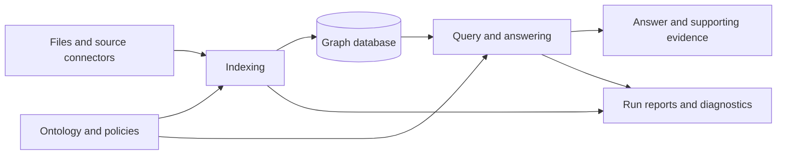

# SEOCHO

**Ontology-aligned middleware for agentic graph memory.**

[](https://pypi.org/project/seocho/)
[](https://pypi.org/project/seocho/)
[](https://pypi.org/project/seocho/)
[](LICENSE)

[Quickstart](QUICKSTART.md) · [Documentation](docs/README.md) ·
[Your data & experiments](docs/EXPERIMENT_PLATFORM.md) ·
[Examples](examples/) · [Contributing](CONTRIBUTING.md)

SEOCHO connects document indexing and graph-grounded answering through the same
ontology. Define your entities, relationships and constraints; ingest your data;
then inspect the graph evidence behind agent answers.

It ships as a **Python SDK** and an optional **HTTP runtime**. You own the data,
graph database, model provider and operational evidence.


```mermaid
flowchart LR
    D[Files and source connectors] --> I[Indexing]
    O[Ontology and policies] --> I
    I --> G[(Graph database)]
    O --> Q[Query and answering]
    G --> Q
    Q --> A[Answer and supporting evidence]
    I --> R[Run reports and diagnostics]
    Q --> R
```

## What you can do

| Workflow | SEOCHO provides | Inspect |
|---|---|---|
| Build graph memory | extraction, validation and graph shaping against your ontology | indexed facts, file failures and validation results |
| Ask questions | schema-aware query and answer paths | support status, missing slots and available graph evidence |
| Bring existing data | files and source connectors feeding the indexing path | normalized records and run specifications |
| Evaluate a change | reproducible run/sweep workflows and saved-run comparison | matched inputs, per-question changes and failed stages |
| Serve agents | an HTTP runtime with policy checks and workspace propagation | runtime responses, traces and deployment configuration |

**Current scope:** alpha software; DozerDB is the graph baseline and OpenAI Agents
SDK is the agent runtime baseline. The first-run CLI requires a DozerDB/Neo4j Bolt
endpoint. Run completion is execution evidence, not proof of answer correctness,
backend interchangeability or production readiness.

## Run your first project

You need Python 3.10–3.12, [uv](https://docs.astral.sh/uv/), a running
DozerDB/Neo4j database, and a model-provider key. Use the
[deployment guide](docs/RUNTIME_DEPLOYMENT.md) if you need a graph service.

```bash
uv venv
source .venv/bin/activate
uv pip install "seocho[local]"
seocho new hello-seocho
cd hello-seocho
```

Export your provider key; MARA is the default preset:

```bash
export MARA_API_KEY=...
export NEO4J_URI=bolt://localhost:7687
export NEO4J_USER=neo4j
export NEO4J_PASSWORD=...
```

In the generated `seocho.run.yaml`, replace `graph` and set an existing target
`database` (use a separate database for experiments):

```yaml
graph:
  uri: ${NEO4J_URI}
  user: ${NEO4J_USER}
  password: ${NEO4J_PASSWORD}
database: neo4j
```

```bash
seocho run --dry-run
seocho run
```

Dry-run validates local configuration and structured inputs without model calls.
A real run also checks the target database, indexes the sample documents, asks
the declared questions and saves `report.md` / `report.json` in a unique `runs/`
directory. Open the report's status and diagnostics first.

Other providers are selected with `models.default: provider/model`; see
[Run Specs](docs/RUN_SPECS.md). From a source checkout, use
`uv sync --locked --extra dev` and prefix commands with `uv run`.

## Use your data and compare changes

Replace the generated `docs/` and `schema.yaml`, and give your questions stable
IDs. Start with a small representative slice of your own corpus. The existing
[connectors](docs/CONNECTORS.md) can materialize external sources as JSONL.

For baseline and candidate runs, keep the input/question set fixed and use
separate prepared graph targets. `--no-track` ensures every input is indexed
without reusing the file-change cache:

```bash
seocho run seocho.run.yaml --no-track --output runs/baseline
# Apply the intended change; configure the candidate's separate graph target.
seocho run seocho.run.yaml --no-track --output runs/candidate

seocho runs compare runs/baseline/RUN_ID runs/candidate/RUN_ID \
  --change source \
  --hypothesis 'The indexing fix reduces failed documents without losing support' \
  --output-dir comparisons/indexing-fix
```

Replace `RUN_ID` with each printed run directory. Comparison is offline. Changed
corpora, missing questions or undeclared conditions prevent aggregate deltas;
individual failures remain visible. Missing cost or evidence data is marked
unavailable. For a model change, declare `--change models` instead.

Export a local, searchable visual report and SEOCHO module map with
`seocho runs view runs/candidate/RUN_ID --output views/candidate.html`.
Add `--baseline` to inspect the saved-run comparison. Module responsibilities
are shown separately from observed execution; no external service is needed.

The [experiment guide](docs/EXPERIMENT_PLATFORM.md) covers failures, fingerprints,
repeatable environments and interpretation. Use [Benchmarks](docs/BENCHMARKS.md)
for research protocols. An answer rate or reference-string match is a proxy;
quality and performance claims require appropriate live evaluation.

## Use the Python SDK or HTTP runtime

The same project ontology can be used from Python:

```python
import os
from seocho import Ontology, Seocho

client = Seocho.local(
    Ontology.load("schema.yaml"),
    graph=os.environ["NEO4J_URI"],
    neo4j_user=os.environ["NEO4J_USER"],
    neo4j_password=os.environ["NEO4J_PASSWORD"],
    llm="mara/MiniMax-M2.7",
)
try:
    client.add("Jane Park is the CEO of Acme Corp.", database="neo4j")
    print(client.ask("Who leads Acme Corp?", database="neo4j"))
finally:
    client.close()
```

Use `Seocho.remote("http://localhost:8001")` for an existing runtime service.
See the [SDK guide](docs/PYTHON_INTERFACE_QUICKSTART.md),
[SDK contract](docs/SDK_CONTRACT.md) and [backend extension contracts](docs/PLUGIN_SURFACE.md).
Source connectors ingest data; backend adapters control where SEOCHO executes
and stores it. They serve different roles.

## Find the right code

| Area | Location |
|---|---|
| SDK and canonical engine | [`src/seocho/`](src/seocho/) |
| Indexing / query | [`src/seocho/index/`](src/seocho/index/) · [`src/seocho/query/`](src/seocho/query/) |
| Runtime shell / compatibility | [`runtime/`](runtime/) · [`extraction/`](extraction/) |
| Tests / runnable examples | [`tests/seocho/`](tests/seocho/) · [`examples/`](examples/) |
| Architecture and decisions | [`docs/`](docs/) · [Decision log](docs/decisions/DECISION_LOG.md) |
| Documentation site | [`website/`](website/) |

The [repository layout](docs/REPOSITORY_LAYOUT.md) explains secondary and local
surfaces. Private datasets, run artifacts and agent/editor state stay out of Git.

## Contribute with a person or coding agent

Start with a reproducible issue and a bounded acceptance criterion. Use
[CONTRIBUTING.md](CONTRIBUTING.md) for setup and review, [AGENTS.md](AGENTS.md)
for the coding contract, and [Agent Workflow](docs/AGENT_WORKFLOW.md) for isolated
task checkouts and handoffs. The [workflow](docs/WORKFLOW.md) and
[issue/task system](docs/ISSUE_TASK_SYSTEM.md) define the delivery and review trail.

```bash
make agent-doctor
make agent-start TASK=issue-123
# Change into the printed checkout, install the locked dev environment, edit/test.
make agent-check
```

Report failures with the smallest safe reproduction and a redacted diagnostic
excerpt. Link related ADRs and before/after evidence in the PR. See
[GitHub Automation](docs/GITHUB_AUTOMATION.md) for required checks, including
[docs consistency](.github/workflows/docs-consistency.yml), and
[release operations](docs/RELEASE_AND_COMMUNITY_OPERATIONS.md) for publishing.

[Report a bug](https://github.com/tteon/seocho/issues/new/choose) ·
[Security policy](SECURITY.md) · [Changelog](CHANGELOG.md) · [MIT license](LICENSE)
