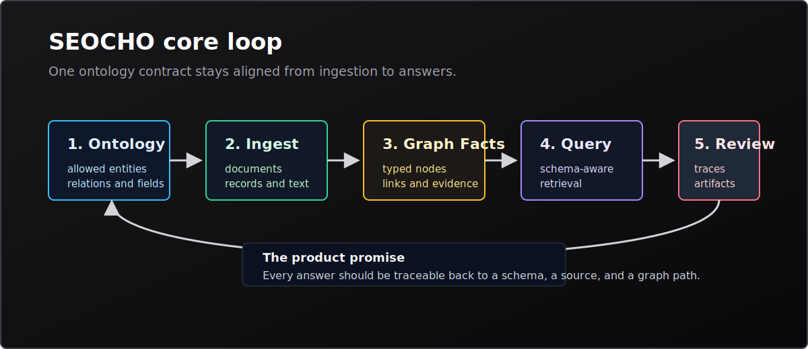

# SEOCHO Documentation

SEOCHO helps agents use graph memory with an explicit ontology contract.

This page is the front door. It explains what SEOCHO does, which document to
read first, and which words matter before you go deeper.

## Start Here

| Goal | Read | You are done when |
|---|---|---|
| Understand the idea | [Why SEOCHO](WHY_SEOCHO.md) | you can explain ontology-aligned graph memory in one paragraph |
| Run the smallest example | [Quickstart](../QUICKSTART.md) | you can define one ontology, add text, and ask one question |
| Use Python directly | [Python SDK](PYTHON_INTERFACE_QUICKSTART.md) | you know when to use local, remote, or explicit backend mode |
| Bring your own files | [Bring Your Data](APPLY_YOUR_DATA.md) | you know how your records enter the graph |
| Run a service | [Runtime Deployment](RUNTIME_DEPLOYMENT.md) | you can start the API, UI, and graph services |
| Contribute | [Open Source Playbook](OPEN_SOURCE_PLAYBOOK.md) | you know how to open a scoped issue or PR |

If you only have ten minutes, read [Why SEOCHO](WHY_SEOCHO.md), then run the
[Quickstart](../QUICKSTART.md).

## The Core Loop

SEOCHO keeps the same ontology contract across ingestion, graph writes,
retrieval, answer synthesis, and runtime APIs.



In plain terms:

| Step | What happens | What you can inspect |
|---|---|---|
| Define ontology | Name the allowed entities, relationships, and properties. | ontology file or Python object |
| Ingest data | Load text, records, or files. | input files and run config |
| Shape graph facts | Extract entities and relationships that fit the ontology. | graph payloads and validation notes |
| Query graph memory | Ask questions with schema-aware retrieval. | Cypher, evidence, and traces |
| Improve the contract | Review failures, add rules, and rerun. | artifacts, reports, and PRs |

Everything else in the repository exists to make this loop repeatable,
observable, or deployable.

## Quick Vocabulary

| Term | Meaning here | Simple example |
|---|---|---|
| Ontology | The schema the agent must respect. | `Person WORKS_AT Company` |
| Graph memory | Stored facts plus provenance and constraints. | who said a fact, where it came from, and how it links |
| Indexing | Turning documents into graph-shaped facts. | extracting companies, incidents, controls, and relationships |
| Semantic query | Resolving intent before generating a graph query. | mapping "risk owner" to the right node and relation |
| Runtime | The HTTP service for shared usage. | an app or agent calls SEOCHO instead of local Python |
| Artifact | A generated file you can review. | trace, rule profile, report, or graph export |

## Choose A Path

| Reader | Best first path |
|---|---|
| New user | [Quickstart](../QUICKSTART.md) -> [Python SDK](PYTHON_INTERFACE_QUICKSTART.md) |
| Data or RAG builder | [Bring Your Data](APPLY_YOUR_DATA.md) -> [Run Specs](RUN_SPECS.md) |
| Agent developer | [Python SDK](PYTHON_INTERFACE_QUICKSTART.md) -> [Files and Artifacts](FILES_AND_ARTIFACTS.md) |
| Operator | [Runtime Deployment](RUNTIME_DEPLOYMENT.md) -> [Workflow](WORKFLOW.md) |
| Contributor | [Open Source Playbook](OPEN_SOURCE_PLAYBOOK.md) -> [Issue Task System](ISSUE_TASK_SYSTEM.md) |
| Maintainer | [Release And Community Operations](RELEASE_AND_COMMUNITY_OPERATIONS.md) -> [Decision Log](decisions/DECISION_LOG.md) |

## First Local Success

The fastest path is local. It does not require Neo4j, DozerDB, Docker, or a
web server.

```bash
uv pip install "seocho[local]"
```

Then run the quickstart from a checkout:

```bash
export MARA_API_KEY=...
uv run python examples/finance-compliance/quickstart.py --llm mara/MiniMax-M2.5
```

Use the runtime later, when another process needs the same graph contract over
HTTP.

## Document Map

| Area | Documents |
|---|---|
| Product idea | [Why SEOCHO](WHY_SEOCHO.md), [Philosophy](PHILOSOPHY.md), [Architecture](ARCHITECTURE.md) |
| Getting started | [Quickstart](../QUICKSTART.md), [Python SDK](PYTHON_INTERFACE_QUICKSTART.md), [Bring Your Data](APPLY_YOUR_DATA.md) |
| Repeatable runs | [Run Specs](RUN_SPECS.md), [Tutorial First Run](TUTORIAL_FIRST_RUN.md), [Files and Artifacts](FILES_AND_ARTIFACTS.md) |
| Operations | [Runtime Deployment](RUNTIME_DEPLOYMENT.md), [Workflow](WORKFLOW.md), [Release And Community Operations](RELEASE_AND_COMMUNITY_OPERATIONS.md) |
| Open source work | [Open Source Playbook](OPEN_SOURCE_PLAYBOOK.md), [Issue Task System](ISSUE_TASK_SYSTEM.md), [Contributing](../CONTRIBUTING.md) |

## Common Questions

| Question | Short answer | Read next |
|---|---|---|
| Do I need a graph database for hello world? | No. Start with the embedded local path. | [Quickstart](../QUICKSTART.md) |
| When should I use the runtime? | When another app or agent needs a shared HTTP boundary. | [Runtime Deployment](RUNTIME_DEPLOYMENT.md) |
| What does the ontology control? | It guides extraction, validation, graph writes, retrieval, and answers. | [Why SEOCHO](WHY_SEOCHO.md) |
| Where do generated files go? | SEOCHO writes reviewable artifacts such as traces, reports, and profiles. | [Files and Artifacts](FILES_AND_ARTIFACTS.md) |
| Is debate mode the default? | No. Start with semantic graph QA. Use debate for explicit comparison. | [Python SDK](PYTHON_INTERFACE_QUICKSTART.md) |
| How do GitHub, Ghost, and Discord fit together? | GitHub is source of truth, Ghost is the public archive, Discord is real-time discussion. | [Release And Community Operations](RELEASE_AND_COMMUNITY_OPERATIONS.md) |

## System Surfaces

| Surface | Owner path | Main question |
|---|---|---|
| Public SDK | `src/seocho/` | how do users ingest, query, and configure SEOCHO from Python? |
| Query and retrieval | `src/seocho/query/` | how does intent become graph-grounded evidence? |
| Indexing and graph shaping | `src/seocho/index/` | how do documents become graph facts? |
| Runtime API | `runtime/` | how do external agents and apps consume the graph contract? |
| Extraction compatibility | `extraction/` | which legacy imports or batch paths still need to work? |
| Examples | `examples/` | what should a real user copy first? |
| Docs and governance | `docs/` | what contract should future contributors preserve? |

## Deeper References

Use these after the first local success:

| Topic | Reference |
|---|---|
| Architecture details | [Architecture](ARCHITECTURE.md), [Internal Class Design](INTERNAL_CLASS_DESIGN.md), [Graph-RAG Agent Handoff Spec](GRAPH_RAG_AGENT_HANDOFF_SPEC.md) |
| Repository shape | [Repository Layout](REPOSITORY_LAYOUT.md), [Workflow](WORKFLOW.md) |
| Automation | [GitHub Automation](GITHUB_AUTOMATION.md), [Release And Community Operations](RELEASE_AND_COMMUNITY_OPERATIONS.md) |
| Design history | [Decision Log](decisions/DECISION_LOG.md), [Reference Docs](reference/README.md) |
| Historical material | [Archive](archive/README.md), [Maintainer Docs](maintainers/README.md) |

## Docs Site Integration

- GitHub `README.md` is the fastest product landing page.
- `docs/*` is the source of truth for long-form product, operator, and system
  contracts.
- `website/` is the tracked Astro/Starlight source app in this repository.
- `website/scripts/generate-docs.mjs` materializes selected `/docs/*` and
  `/blog/*` pages from repo-root source docs for the in-repo site app.
- Generated mirror files under `website/src/content/docs/docs/` are derived
  site artifacts. Do not edit them by hand; regenerate them when source docs
  change.
- Validate the site with `cd website && npm run check:docs && npm run build`.
