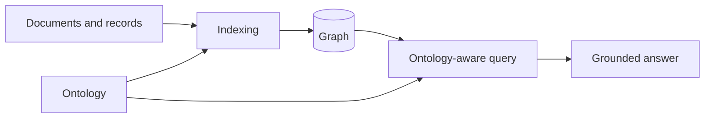

# SEOCHO

Ontology-aligned middleware between agents and graph databases.

Use this deck for a 20-30 minute product and architecture walkthrough.

---

# The Problem

Agentic RAG demos are easy.

Production graph memory is hard because these pieces drift:

- extraction schema
- graph writes
- query generation
- agent tool use
- runtime policy
- semantic artifacts
- evaluation traces

SEOCHO exists to keep those pieces aligned.

---

# The SEOCHO Contract

```text
ontology
  -> indexing behavior
  -> graph contract
  -> query behavior
  -> agent reasoning boundary
  -> runtime artifacts
```

The user should not maintain five separate schema descriptions.

One ontology should govern the system.

---

# Product Positioning

SEOCHO is for developers who want agents and graph databases to stay
ontology-aligned automatically.

It is strongest when:

- graph DB is a primary store, not a side cache
- schema drift is expensive
- provenance and auditability matter
- local SDK and runtime API need the same semantic contract

---

# Beginner Mental Model



The ontology is not documentation.

It is executable context.

---

# What The User Writes

Minimal SDK path:

```python
from seocho import Ontology, Seocho

ontology = Ontology.from_jsonld("schema.jsonld")
client = Seocho.local(ontology, llm="openai/gpt-4o-mini")

client.add("ACME acquired Beta in 2024.", database="kg")
print(client.ask("Who did ACME acquire?", database="kg"))
```

---

# What SEOCHO Does

When the user calls `add()`:

- shapes extraction with ontology context
- extracts entities and relationships
- applies validation and design defaults
- writes graph records
- keeps metadata for later query diagnosis

When the user calls `ask()`:

- chooses a graph-aware query path
- generates ontology-aware Cypher
- executes against the graph
- synthesizes an answer
- records support and diagnostic signals

---

# Two User Modes

| Mode | User experience | Best for |
|---|---|---|
| Embedded local | `Seocho.local(ontology)` | first run, SDK authoring, experiments |
| Runtime stack | `make up` + HTTP APIs | UI, DozerDB, team workflows |

The local SDK should feel easy.

The runtime should feel governed.

Both should share the same ontology contract.

---

# Core Architecture

SEOCHO is a modular monolith.

That is intentional.

```text
seocho/
  ontology and SDK contracts
  indexing pipeline
  query pipeline
  local engine

runtime/
  API wiring
  policy and validation
  workspace/database handling

extraction/
  compatibility shell during migration
```

---

# Module Map

| Layer | Module | Responsibility |
|---|---|---|
| Public facade | `seocho/client.py` | stable user-facing `add()` / `ask()` surface |
| Local engine | `seocho/local_engine.py` | SDK orchestration without HTTP |
| Data plane | `seocho/index/` | extraction, linking, validation, graph writes |
| Control plane | `seocho/query/` | graph query strategy, repair, synthesis |
| Runtime shell | `runtime/` | API, policy, workspace and database routing |
| Compatibility | `extraction/` | temporary migration shell |

The architecture goal is fewer product surfaces, not fewer files.

---

# Code Snippet: Public Facade

The intended beginner experience stays small:

```python
from seocho import Ontology, Seocho

ontology = Ontology.from_jsonld("schema.jsonld")
client = Seocho.local(
    ontology,
    llm="openai/gpt-4o-mini",
    workspace_id="finance-dev",
)

client.add("ACME acquired Beta in 2024.", database="financekg")
answer = client.ask(
    "Who did ACME acquire?",
    database="financekg",
    reasoning_mode=True,
    repair_budget=1,
)
```

---

# Code Snippet: Data Plane Seam

`add()` maps to an indexing request:

```python
from seocho.index.ingestion_facade import IngestRequest

request = IngestRequest(
    content="ACME acquired Beta in 2024.",
    workspace_id="finance-dev",
    database="financekg",
    category="filing",
    metadata={"source": "tutorial"},
)
```

This seam lets SDK and runtime share the same ingestion shape.

---

# Code Snippet: Control Plane Seam

`ask()` eventually needs a graph query contract:

```python
from seocho.query.query_proxy import QueryRequest

request = QueryRequest(
    cypher="MATCH (c:Company)-[:ACQUIRED]->(t:Company) RETURN c, t",
    workspace_id="finance-dev",
    database="financekg",
    ontology_profile="finance-core",
)
```

The policy layer can validate this before it reaches a graph backend.

---

# Code Snippet: Event Envelope

Internal events keep traces consistent:

```python
from seocho.events import DomainEvent

event = DomainEvent(
    kind="query.succeeded",
    workspace_id="finance-dev",
    payload={"database": "financekg", "result_count": 1},
)
```

This is the base shape for future tracing and Opik export.

---

# SDK vs Runtime Boundary

| SDK should own | Runtime should own |
|---|---|
| ontology context shaping | request validation |
| indexing and linking semantics | workspace/database registry |
| query strategy and repair semantics | policy and authorization checks |
| agent reasoning behavior | API route wiring |
| local embedded execution | deployment health/readiness |

If semantic logic exists only in runtime, local SDK and server behavior drift.

---

# Data Plane

Indexing is a pipe-and-filter pipeline:

```text
raw data
  -> parse
  -> extract
  -> link
  -> deduplicate
  -> validate
  -> write graph
```

Important outputs:

- graph nodes and relationships
- provenance metadata
- semantic artifacts
- rule/readiness reports

---

# Control Plane

Query is an ontology-aware control loop:

```text
question
  -> graph target
  -> ontology context
  -> Cypher strategy
  -> graph execution
  -> support assessment
  -> answer synthesis
```

Reasoning mode adds bounded repair, not unlimited agent wandering.

---

# YAML Indexing Design

Indexing design captures ingestion choices in a reviewable file.

```yaml
name: lpg-finance-provenance
graph_model: lpg
storage_target: ladybug
ontology:
  required: true
  profile: finance-fast
materialization:
  provenance_mode: full
reasoning_cycle:
  enabled: true
```

If the ontology binding is missing, SEOCHO should fail early.

---

# YAML Agent Design

Agent design captures reusable orchestration patterns.

```yaml
name: planning-multi-agent-finance
pattern: planning_multi_agent
ontology:
  required: true
  profile: finance-core
agent:
  execution_mode: supervisor
query:
  answer_style: evidence
tools:
  - graph_query
  - filing_search
```

The agent pattern is flexible.

The ontology binding is not optional.

---

# JSON-LD Ontology Path

Teams can keep ontology files in git:

```python
from seocho import Ontology, Seocho

ontology = Ontology.from_jsonld("examples/datasets/fibo_plus.jsonld")

client = Seocho.from_indexing_design(
    "examples/indexing_designs/lpg_finance_provenance.yaml",
    ontology=ontology,
    llm="openai/gpt-4o-mini",
    workspace_id="finance-dev",
)
```

This is the intended tutorial shape.

---

# Agent Patterns To Teach First

| Pattern | Why users care |
|---|---|
| Planning + multi-agent | split a complex finance question into subtasks |
| Reflection chain | check whether evidence supports the final answer |
| Memory + tool use | combine graph memory with external lookups |

SEOCHO value add:

Each pattern stays bound to the ontology and graph contract.

---

# Runtime Surface

The runtime owns deployment concerns:

- request validation
- workspace scoping
- policy checks
- database registry
- route wiring
- health/readiness endpoints

The runtime should not own core semantic logic when the SDK can own it.

---

# Observability

SEOCHO should make these visible:

- source records
- graph writes
- semantic artifacts
- query traces
- support assessments
- provider/model metadata
- token and latency metrics

Preferred tracing backend: Opik.

Contract: vendor-neutral trace payloads first, Opik as team backend.

---

# Evaluation Lesson From FinDER

Recent local FinDER category-slice comparison showed:

- model calls work across several providers
- better models did not automatically solve answer quality
- graph writes happened, but query support was often insufficient
- provider reliability matters, especially for long benchmark runs

Conclusion:

Improve indexing/query contract before chasing model swaps.

---

# What To Optimize Next

High-value engineering targets:

1. Preserve numeric and period-specific facts during indexing.
2. Improve metric/delta query planning.
3. Make evidence bundle gaps more explicit.
4. Add progress JSONL to benchmark runner.
5. Keep feature-level tests in CI.

This is more important than running the full dataset too early.

---

# Beginner Demo Flow

Recommended live demo:

1. Show JSON-LD ontology.
2. Show indexing YAML.
3. Run `Seocho.from_indexing_design(...)`.
4. Add one finance record.
5. Ask one question.
6. Inspect graph write metadata.
7. Show how the same contract moves to runtime.

Keep the first demo small.

---

# Deep Dive Flow

For architecture review:

1. Product problem and contract.
2. SDK vs runtime boundary.
3. Data plane.
4. Control plane.
5. Ontology context propagation.
6. Agent design and indexing design YAML.
7. Observability and evaluation.
8. Current gaps and next engineering slice.

---

# What SEOCHO Is Not

SEOCHO is not:

- a vector-only retrieval wrapper
- a lowest-friction generic memory demo
- a fully managed cloud platform today
- a place to hide schema drift behind prompts

SEOCHO is:

- ontology-first
- graph-native
- provenance-aware
- local SDK plus runtime contract

---

# Closing Message

SEOCHO lets users keep one semantic contract:

```text
ontology -> graph -> agent -> answer
```

The beginner experience should feel like:

```text
edit JSON-LD
edit YAML
run
inspect
iterate
```

That is the product surface to keep sharpening.
