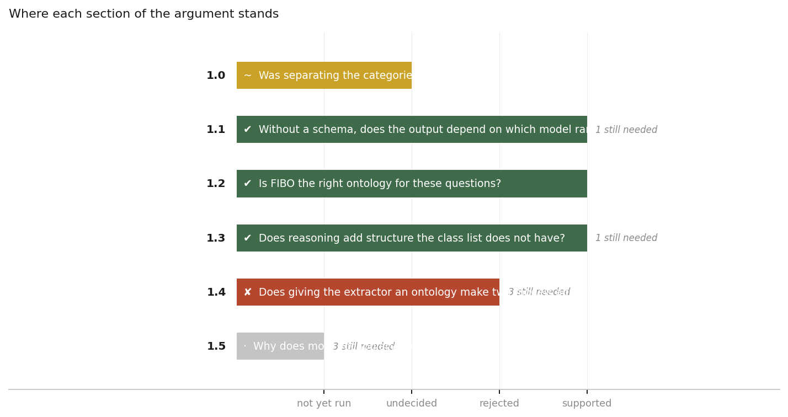

# Findings

One directory per section of the argument. Each holds the question, the hypothesis as written before the run, the numbers quoted from the artifact, a verdict against that hypothesis, and my reading kept separate from both.

Generated 2026-08-02 02:52 UTC by `experiments/findings.py --write`.

| Section | Question | Verdict |
|---|---|---|
| [1.0 Was separating the categories necessary?](1.0-isolation/FINDING.md) | If every category shared one graph, would merging on name fuse things that are no… | ~ undecided |
| [1.1 Without a schema, does the output depend on which model ran?](1.1-model-dependence/FINDING.md) | Do three models given the same document produce graphs whose identifiers can be m… | ✔ supported |
| [1.2 Is FIBO the right ontology for these questions?](1.2-ontology-fit/FINDING.md) | Before asking whether the ontology helped, does it even cover what the corpus ask… | ✔ supported |
| [1.3 Does reasoning add structure the class list does not have?](1.3-axioms/FINDING.md) | The extraction prompt receives a flat list of class names. Would entailment give … | ✔ supported |
| [1.4 Does giving the extractor an ontology make two models agree?](1.4-result/FINDING.md) | Holding documents, prompt, chunking and seed fixed, does the schema handed to the… | ✘ rejected |
| [1.5 Why does more vocabulary lower agreement?](1.5-mechanism/FINDING.md) | Is the fragmentation caused by the number of classes, by FIBO's particular classe… | · not yet run |

## Outstanding before the paper can close

- **1.1** — a second run of one model, to separate between-model disagreement from within-model variance
- **1.3** — a DL reasoner, to turn these floors into values
- **1.4** — a confidence interval, before any difference is stated as a result
- **1.4** — a correctness measure, since a schema could lower agreement and raise accuracy
- **1.4** — a content measure, since agreement on names is not agreement on facts
- **1.5** — type findability, no-ontology against FIBO, paired by case
- **1.5** — alias collapse, FIBO against FIBO-plus-synonyms
- **1.5** — a control condition with seventy non-FIBO classes

