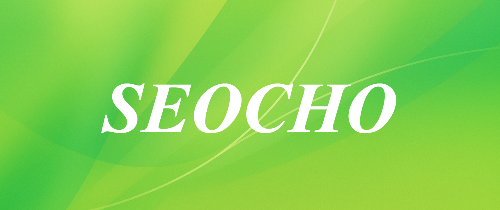

# Seocho: Open Source Data Lineage & GraphRAG Framework



**Seocho** is an open-source framework that tracks data lineage across your entire data stack, stores relationships in graph databases, and validates data quality - all while preparing your data for AI-powered insights through GraphRAG (Graph Retrieval-Augmented Generation).


Key features

1.Designed for multi-domain, multi-semantic knowledge graphs.

2.Bridges enterprise data catalogs with graph reasoning.

3.Fully open-source, so you can learn, adapt, and extend.

4.Optimized for GraphRAG, the next frontier of retrieval-augmented generation using soft-prompting & hard-prompting.

---

## 🚀 Features

### 🔍 **Data Lineage Tracking**
- **DataHub integration** - Track every dataset, transformation, and data movement
- **Complete audit trails** - See exactly how your data flows from source to destination
- **Impact analysis** - Understand downstream effects before making changes

### 🗄️ **Graph Database Storage**
- **DozerDB (Neo4j)** - Store complex relationships between data entities using multi-instance
- **Native graph queries** - Find connections and patterns in your data
- **Real-time updates** - Live lineage as your data changes

### ✅ **Data Quality Validation**
- **Automated auditing** - openai SDK agent engine validates data completeness and accuracy
- **Quality scoring** - Quantitative metrics for data trustworthiness
- **Alert system** - Get notified when data quality drops

### 📊 **Interactive Visualization**
- **NeoDash dashboards** - Beautiful, interactive charts and graphs high 
- **Real-time lineage maps** - See your data's journey visually
- **Custom dashboards** - Build views for different stakeholders for knowledge graph diversity schema

### 🤖 **AI-Ready Architecture**
- **GraphRAG foundation** - Prepare your data for LLM-powered insights
- **Semantic relationships** - Rich context for AI models using triplets and graph qualification by graph embedding
- **Trust scores** - AI knows which data to trust based on ontology
- **GraphRAG Evaluation Dataset** - Making your own Multihop query and compare performance between other RAG pipeline.
---

## 🧭 System Overview


### Full Flow

DataHub catalogs and tracks data lineage from your silos.

Ontology Factory refines and unifies semantics into a graph schema.

DozerDB manages and serves graph data in domain-specific instances.

GraphRAG retrieves, compacts, and feeds graph context to the LLM for accurate, grounded answers.

---

## 🧑‍💻 Getting Started

### Prerequisites

* Docker
* Docker Compose
* Python 3.8+ (for DataHub CLI)

### Quickstart

```bash
git clone https://github.com/your-org/seocho.git
cd seocho
make bootstrap
make up
```

Access the following:

* DataHub UI: [http://localhost:9002](http://localhost:9002)
* Neodash Dashboard: [http://localhost:5005](http://localhost:5005)

To ingest sample data:

```bash
make ingest-glossary
```

---

## 📦 Project Structure

```
seocho/
├── datahub/                # DataHub launcher and Dockerfile
├── engine/                 # Python-based auditing logic
├── neo4j/                  # DozerDB volume mounts (data, logs, plugins, etc.)
├── workspace/              # Shared data directory (input/output)
├── sharepoint/             # External shareable data volume
├── docker-compose.yml      # Main orchestration
├── Makefile                # Developer shortcuts
├── bootstrap.sh            # Initial environment setup script
├── recipe.yml              # Ingestion config for CSV
├── recipe_glossary.yml     # Ingestion config for RDF glossary terms
└── README.md               # Project intro & usage
```

---

## ✨ Example Use Case

1. Ingest sample CSV into DataHub via CLI:

```bash
datahub ingest -c recipe.yml
```

2. Ingest RDF-based taxonomy as glossary terms:

```bash
make ingest-glossary
```

3. DataHub triggers Engine to validate quality/completeness
4. Engine stores result as new metadata (or graph node)
5. Neodash shows the lineage & quality metrics together
6. Future: LLM retrieves info via GraphRAG to answer questions

---

## 🤖 Toward GraphRAG

Seocho is designed as a foundation for building a **GraphRAG** system:

* **GraphDB stores structured relationships** (entities, time, metrics)
* **Lineage ensures traceability and trust in source data**
* **Audit results improve RAG responses with data quality info**

---

## 🤝 Contributing

We welcome issues, discussions, and PRs!

To contribute:

```bash
# Fork + Clone
# Run locally
# Suggest improvements via PR
```

---

## 📄 License

MIT License © 2025 Seocho Contributors

---

## 📬 Contact

Questions? Ideas? Reach us via [GitHub Issues](https://github.com/your-org/seocho/issues)
